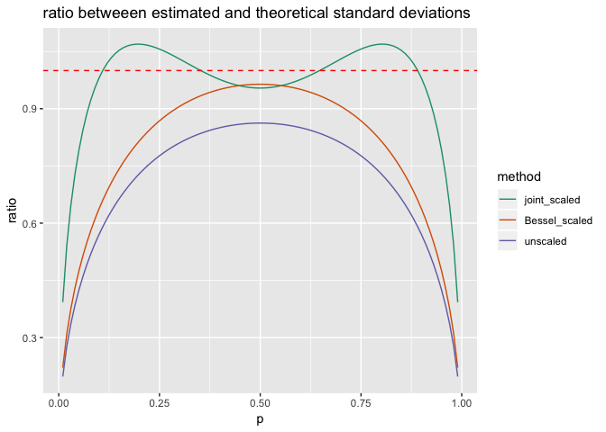
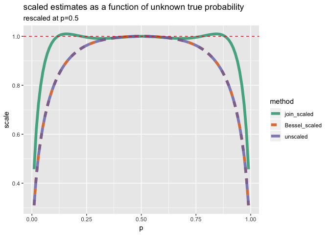

Bias Ests
================

``` r
library("rqdatatable")
```

    ## Loading required package: rquery

``` r
library("wrapr")
library("cdata")
library("ggplot2")
library("glmnet")
```

    ## Loading required package: Matrix

    ## Loading required package: foreach

    ## Loaded glmnet 2.0-16

``` r
set.seed(32535)

naive_sd_fun <- function(x) {
  # also equals (sum(x)/length(x))*(1-sum(x)/length(x))
  sqrt(mean((mean(x)-x)^2))
}

Bessel_sd_fun <- function(x) {
  sd(x)
}

eval_scale_adjustment_table <- function(scale_adjustment_table, p, sd_fun = naive_sd_fun) {
  n <- length(scale_adjustment_table)-1
  obs <- 0:n
  probs <- dbinom(obs, size = n, prob = p)
  evals <- vapply(obs,
                function(ki) {
                  sd_fun(c(rep(1, ki), rep(0, n-ki)))*scale_adjustment_table[[ki+1]]
                }, numeric(1))
  sd_target <- sqrt(p*(1-p))
  sum(probs*evals)/sd_target
}


# related to Wald mini/max type ideas and:
# http://www.win-vector.com/blog/2014/07/frequenstist-inference-only-seems-easy/
# https://mathoverflow.net/questions/177574/existence-of-solutions-of-a-polynomial-system 
# think this is under-determined, so could ask for symmetry or all coefs near 1.
# also a lot like a Chebyshev polynomial.
solve_for_scaling_table <- function(n, sd_fun = naive_sd_fun) {
  if(n<2) {
    return(rep(1, n+1))
  }
  obs <- 1:(n-1)
  ps <- obs/n
  d <- data.frame(target = sqrt(ps*(1-ps)))
  vars <- paste0("s_", obs)
  for(ki in seq_len(length(obs))) {
    k <- obs[[ki]]
    var <- vars[[ki]]
    d[[var]] <- 0
    for(ii in seq_len(length(ps))) {
      pi <- ps[[ii]]
      prob <- dbinom(k, size = n, prob = pi)
      est <- sd_fun(c(rep(1, k), rep(0, n-k)))
      cij <- prob*est
      d[[var]][[ii]] <- cij
      d$target[[ii]] <- d$target[[ii]] - cij # regularize towards zero
    }
  }
  #m <- lm(mk_formula("target", vars, intercept = FALSE), data= d)
  #soln <- as.numeric(m$coefficients) + 1
  m <- glmnet(as.matrix(d[, vars, drop = FALSE]), d$target, 
              alpha=0, lambda=1e-8, family = "gaussian", intercept = FALSE,
              lower.limits = -10,
              standardize = FALSE)
  soln <- as.numeric(m$beta) + 1
  mx <- max(soln)
  c(mx, soln, mx)
}


tab <- solve_for_scaling_table(10)
print(tab)
```

    ##  [1] 1.8522661 1.8522661 0.5491785 1.3471479 1.0597513 0.8383810 1.2555957
    ##  [8] 1.0988166 0.7175880 1.7868709 1.8522661

``` r
adjs <- data.frame(p = seq(0, 1, by = 0.01))
adjs$joint_scaled <- vapply(
  adjs$p,
  function(pi) {
    eval_scale_adjustment_table(tab, pi)
  }, numeric(1))
adjs$Bessel_scaled <- vapply(
  adjs$p,
  function(pi) {
    eval_scale_adjustment_table(rep(1, length(tab)), pi, sd_fun = Bessel_sd_fun)
  }, numeric(1))
adjs$unscaled <- vapply(
  adjs$p,
  function(pi) {
    eval_scale_adjustment_table(rep(1, length(tab)), pi)
  }, numeric(1))


adjsp <- unpivot_to_blocks(
  adjs, 
  nameForNewKeyColumn = "method", 
  nameForNewValueColumn = "scale", columnsToTakeFrom = c("joint_scaled", "unscaled", "Bessel_scaled"))
adjsp <- adjsp[!is.na(adjsp$scale), , drop = FALSE]
adjsp$method <- reorder(factor(adjsp$method), -adjsp$scale)


ggplot(data = adjsp, mapping = aes(x = p, y = scale, color = method)) +
  geom_line() +
  geom_hline(yintercept = 1, color = "red", linetype=2) + 
  scale_color_brewer(palette = "Dark2") + 
  ggtitle("scaled estimates as a function of unknown true probability")
```



``` r
adjs[adjs$p==0.5, , drop = FALSE]
```

    ##      p joint_scaled Bessel_scaled  unscaled
    ## 51 0.5     1.000118     0.9959094 0.9448026

``` r
adjs2 <- adjs
for(col in c("joint_scaled", "unscaled", "Bessel_scaled")) {
  adjs2[[col]] <- adjs2[[col]]/adjs2[[col]][adjs2$p==0.5]
}
adjs2[adjs2$p==0.5, , drop = FALSE]
```

    ##      p joint_scaled Bessel_scaled unscaled
    ## 51 0.5            1             1        1

``` r
adjsp2 <- unpivot_to_blocks(
  adjs2, 
  nameForNewKeyColumn = "method", 
  nameForNewValueColumn = "scale", columnsToTakeFrom = c("joint_scaled", "unscaled", "Bessel_scaled"))
adjsp2 <- adjsp2[!is.na(adjsp2$scale), , drop = FALSE]
adjsp2$method <- reorder(factor(adjsp2$method), -adjsp2$scale)

ggplot(data = adjsp2, mapping = aes(x = p, y = scale, 
                                    color = method,
                                    linetype = method)) +
  geom_line(size=2, alpha=0.8) +
  geom_hline(yintercept = 1, color = "red", linetype=2) + 
  scale_color_brewer(palette = "Dark2") + 
  ggtitle("scaled estimates as a function of unknown true probability",
          subtitle = "rescaled at p=0.5")
```



``` r
data <- as.data.frame(Titanic)

data <- data %.>% 
  select_rows_nse(., 
                  (Class == "Crew") & 
                    (Sex == "Female") & 
                    (Age == "Adult")) %.>%
  orderby(., "Survived")

print(data)
```

    ##    Class    Sex   Age Survived Freq
    ## 1:  Crew Female Adult       No    3
    ## 2:  Crew Female Adult      Yes   20

``` r
universe <- c(rep(0, data$Freq[data$Survived=="No"]),
              rep(1, data$Freq[data$Survived=="Yes"]))

print(universe)
```

    ##  [1] 0 0 0 1 1 1 1 1 1 1 1 1 1 1 1 1 1 1 1 1 1 1 1

``` r
summary1 <- function(x, scale_adjustment_table) {
  naive_var <- mean((mean(x)-x)^2)
  sd_est <- sd(x)
  # https://en.wikipedia.org/wiki/Unbiased_estimation_of_standard_deviation
  # correctly correct for normal, not binomomial as we have here!
  if(length(scale_adjustment_table) != (1+length(x))) {
    stop("wrong sized scale_adjustment table")
  }
  data.frame(mean = mean(x),
             var = var(x),
             sd = sd_est,
             naive_var = naive_var,
             naive_sd = sqrt(naive_var),
             adj_sd = sqrt(naive_var)*scale_adjustment_table[[sum(x)+1]])
}

tabu <- solve_for_scaling_table(length(universe), naive_sd_fun)
print(tabu)
```

    ##  [1] 1.7109424 1.7109424 0.8684519 0.9354189 1.1777021 1.0692204 0.9567474
    ##  [8] 0.9880857 1.0536182 1.0657459 1.0273041 0.9867268 0.9890066 1.0357890
    ## [15] 1.0737013 1.0436437 0.9685827 0.9683659 1.0980121 1.1523923 0.9198409
    ## [22] 0.9007414 1.6931604 1.7109424

``` r
su <- summary1(
  universe, 
  tabu)
print(su)
```

    ##        mean       var        sd naive_var  naive_sd    adj_sd
    ## 1 0.8695652 0.1185771 0.3443502 0.1134216 0.3367812 0.3097851

``` r
n <- length(universe)
Bessel_corrected_var <- (n/(n-1))*su$naive_var
print(Bessel_corrected_var)
```

    ## [1] 0.1185771

``` r
Bessel_corrected_sd <- sqrt(Bessel_corrected_var)
print(Bessel_corrected_sd)
```

    ## [1] 0.3443502

``` r
samp_size <- 5

mk_f <- function(universe, samp_size, summary1) {
  force(universe)
  force(samp_size)
  force(summary1)
  scale_adjustment_table <- 
    solve_for_scaling_table(samp_size, naive_sd_fun)
  f <- function(i) {
    sample <- universe[sample.int(length(universe), 
                                  samp_size, 
                                  replace = TRUE)]
    summary1(sample, scale_adjustment_table)
  }
}

tabs <- solve_for_scaling_table(samp_size, naive_sd_fun)
print(tabs)
```

    ## [1] 1.7104400 1.7104400 0.9188868 0.9257427 1.7068531 1.7104400

``` r
f <- mk_f(universe, samp_size, summary1)


cl <- parallel::makeCluster(parallel::detectCores())
res <- parallel::parLapply(cl, 1:100000, f)
res <- do.call(rbind, res)

as.data.frame(lapply(res, mean))
```

    ##       mean      var        sd naive_var naive_sd    adj_sd
    ## 1 0.870324 0.112814 0.2365771 0.0902512 0.211601 0.3123676
