Bias Ests
================

``` r
library("rqdatatable")
```

    ## Loading required package: rquery

``` r
library("wrapr")
library("cdata")
library("ggplot2")
library("glmnet")
```

    ## Loading required package: Matrix

    ## Loading required package: foreach

    ## Loaded glmnet 2.0-16

``` r
set.seed(32535)

naive_sd_fun <- function(x) {
  # also equals (sum(x)/length(x))*(1-sum(x)/length(x))
  sqrt(mean((mean(x)-x)^2))
}

Bessel_sd_fun <- function(x) {
  sd(x)
}

eval_scale_adjustment_table_ratio <- function(scale_adjustment_table, 
                                              const,
                                              p, sd_fun = naive_sd_fun) {
  n <- length(scale_adjustment_table)-1
  obs <- 0:n
  probs <- dbinom(obs, size = n, prob = p)
  evals <- vapply(obs,
                  function(ki) {
                    sd_fun(c(rep(1, ki), rep(0, n-ki)))*scale_adjustment_table[[ki+1]] + const
                  }, numeric(1))
  sd_target <- sqrt(p*(1-p))
  sum(probs*evals)/sd_target
}

eval_scale_adjustment_table_diff <- function(scale_adjustment_table, 
                                             const,
                                             p, sd_fun = naive_sd_fun) {
  n <- length(scale_adjustment_table)-1
  obs <- 0:n
  probs <- dbinom(obs, size = n, prob = p)
  evals <- vapply(obs,
                  function(ki) {
                    sd_fun(c(rep(1, ki), rep(0, n-ki)))*scale_adjustment_table[[ki+1]] + const
                  }, numeric(1))
  sd_target <- sqrt(p*(1-p))
  sum(probs*evals)-sd_target
}


# related to Wald mini/max type ideas and:
# http://www.win-vector.com/blog/2014/07/frequenstist-inference-only-seems-easy/
# https://mathoverflow.net/questions/177574/existence-of-solutions-of-a-polynomial-system 
# think this is under-determined, so could ask for symmetry or all coefs near 1.
# also a lot like a Chebyshev polynomial (or integral of one), or upside down beta.
# can also try priors like beta(0.5,0.5)
# could also solve for affine version- where we allow addition in addition to scaling.
# must have a really nice form if we integrate the ps-term (likely a calculus of variations solution).
solve_for_scaling_table <- function(n, sd_fun = naive_sd_fun, 
                                    intercept = TRUE,
                                    excess_resolution = 16) {
  if(n<2) {
    return(rep(1, n+1))
  }
  obs <- 1:(n-1)
  vars <- paste0("s_", 1:(n-1))
  ps <- seq(1/(excess_resolution*n), 
            (excess_resolution*n-1)/(excess_resolution*n), 
            by = 1/(excess_resolution*n))
  d <- data.frame(target = sqrt(ps*(1-ps)))
  for(ki in seq_len(length(vars))) {
    k <- obs[[ki]]
    var <- vars[[ki]]
    d[[var]] <- 0
    for(ii in seq_len(length(ps))) {
      pi <- ps[[ii]]
      prob <- dbinom(k, size = n, prob = pi)
      est <- sd_fun(c(rep(1, k), rep(0, n-k)))
      cij <- prob*est
      d[[var]][[ii]] <- cij
      d$target[[ii]] <- d$target[[ii]] - cij # regularize towards zero
    }
  }
  const <- 0.0
  if(length(vars)<=1) {
    m <- lm(mk_formula("target", vars, intercept = intercept), data= d)
    soln <- as.numeric(m$coefficients[vars]) + 1
    if(intercept) {
      const = m$coefficients[["(Intercept)"]]
    } 
  } else {
    m <- glmnet(as.matrix(d[, vars, drop = FALSE]), d$target, 
                alpha=0, lambda=1e-6, family = "gaussian", intercept = intercept,
                weights = dbeta(ps, 0.5, 0.5),
                # lower.limits = -10,
                standardize = FALSE)
    soln <- as.numeric(m$beta) + 1
    if(intercept) {
      const = m$a0
    } 
  }
  list(multipliers = c(0, soln, 0), intercept = intercept, const = const)
}

plot_multipliers <- function(ssoln) {
  tab <- ssoln$multipliers
  const <- ssoln$const
  const_str <- sprintf("%.4g", const)
  n <- length(tab)-1
  dtab <- data.frame(multiplier = tab)
  dtab$observed_count <- 0:(nrow(dtab)-1)
  breaks <- 0:n
  mod <- 10
  while(length(breaks)>20) {
    breaks <- sort(unique(breaks - breaks%%mod))
    mod <- mod*10
  }
  ggplot() + 
    geom_rect(aes(xmin=0, xmax=n, ymin=1-const, ymax=1), alpha = 0.5) +
    geom_point(data = dtab, 
               mapping = aes(x = observed_count,
                             y = multiplier),
               size=3) +
    geom_linerange(data = dtab,
                   mapping = aes(x = observed_count,
                                 ymin = 0,
                                 ymax = multiplier)) + 
    geom_hline(yintercept = const) + 
    geom_hline(yintercept = 1, color = "darkgray", linetype=2) + 
    ggtitle(paste0("std-deviation multiplier window, n=", n, " + ", const_str)) +
    scale_x_continuous(breaks = breaks)
}

plot_estimate_ratios <- function(ssoln) {
  tab <- ssoln$multipliers
  const <- ssoln$const
  const_str <- sprintf("%.4g", const)
  n <- length(tab)-1
  adjs <- data.frame(p = seq(0, 1, by = 0.01))
  adjs$joint_scaled <- vapply(
    adjs$p,
    function(pi) {
      eval_scale_adjustment_table_ratio(tab, const, pi)
    }, numeric(1))
  adjs$Bessel_scaled <- vapply(
    adjs$p,
    function(pi) {
      eval_scale_adjustment_table_ratio(rep(1, length(tab)), 0, pi, sd_fun = Bessel_sd_fun)
    }, numeric(1))
  adjs$unscaled <- vapply(
    adjs$p,
    function(pi) {
      eval_scale_adjustment_table_ratio(rep(1, length(tab)), 0, pi)
    }, numeric(1))
  
  
  adjsp <- unpivot_to_blocks(
    adjs, 
    nameForNewKeyColumn = "method", 
    nameForNewValueColumn = "ratio", 
    columnsToTakeFrom = c("joint_scaled", "unscaled", "Bessel_scaled"))
  adjsp <- adjsp[!is.na(adjsp$ratio), , drop = FALSE]
  adjsp$method <- reorder(factor(adjsp$method), -adjsp$ratio)
  
  
  ggplot(data = adjsp, mapping = aes(x = p, y = ratio, color = method)) +
    geom_line() +
    geom_hline(yintercept = 1, color = "red", linetype=2) + 
    scale_color_brewer(palette = "Dark2") + 
    ggtitle("ratio betweeen estimated and theoretical standard deviations",
            subtitle = paste0("n= ", n, " + ", const_str))
}

plot_estimate_diffs <- function(ssoln) {
  tab <- ssoln$multipliers
  const <- ssoln$const
  const_str <- sprintf("%.4g", const)
  n <- length(tab)-1
  adjs <- data.frame(p = seq(0, 1, by = 0.01))
  adjs$joint_scaled <- vapply(
    adjs$p,
    function(pi) {
      eval_scale_adjustment_table_diff(tab, const, pi)
    }, numeric(1))
  adjs$Bessel_scaled <- vapply(
    adjs$p,
    function(pi) {
      eval_scale_adjustment_table_diff(rep(1, length(tab)), 0, pi, sd_fun = Bessel_sd_fun)
    }, numeric(1))
  adjs$unscaled <- vapply(
    adjs$p,
    function(pi) {
      eval_scale_adjustment_table_diff(rep(1, length(tab)), 0, pi)
    }, numeric(1))
  
  
  adjsp <- unpivot_to_blocks(
    adjs, 
    nameForNewKeyColumn = "method", 
    nameForNewValueColumn = "difference", 
    columnsToTakeFrom = c("joint_scaled", "unscaled", "Bessel_scaled"))
  adjsp <- adjsp[!is.na(adjsp$difference), , drop = FALSE]
  adjsp$method <- reorder(factor(adjsp$method), -adjsp$difference)
  
  
  ggplot(data = adjsp, mapping = aes(x = p, y = difference, color = method)) +
    geom_line() +
    geom_hline(yintercept = 0, color = "red", linetype=2) + 
    scale_color_brewer(palette = "Dark2") + 
    ggtitle("difference betweeen estimated and theoretical standard deviations",
            subtitle = paste0("n=", n, " + ", const_str))
}

cl <- parallel::makeCluster(parallel::detectCores())

intercept <- TRUE

print(paste("*******", intercept))
```

    ## [1] "******* TRUE"

``` r
for(n in c(2, 3, 4, 5, 10, 20, 100)) {
  print("******")
  print(n)
  tab <- solve_for_scaling_table(n, intercept = intercept)
  print(tab)
  plot_multipliers(tab) %.>% print(.)
  plot_estimate_ratios(tab) %.>% print(.)
  plot_estimate_diffs(tab) %.>% print(.)
}
```

    ## [1] "******"
    ## [1] 2
    ## $multipliers
    ## [1] 0.000000 1.382903 0.000000
    ## 
    ## $intercept
    ## [1] TRUE
    ## 
    ## $const
    ## [1] 0.1653139

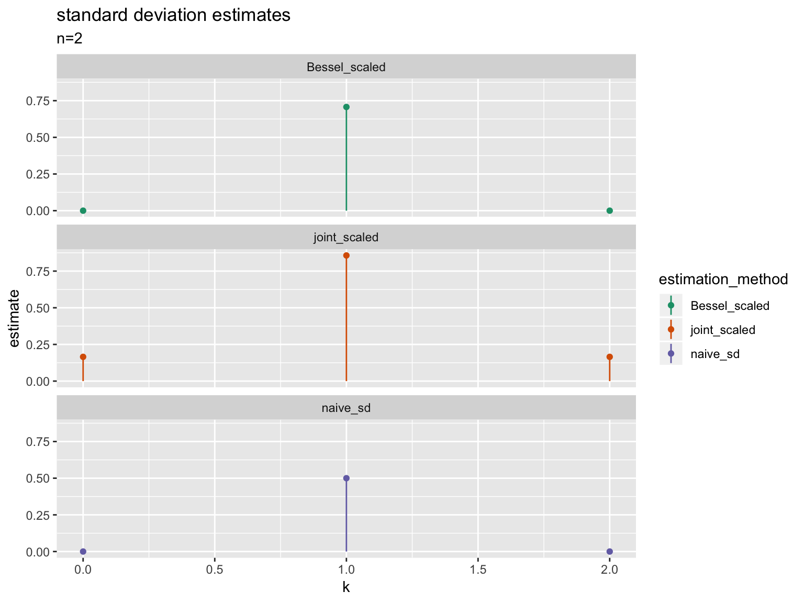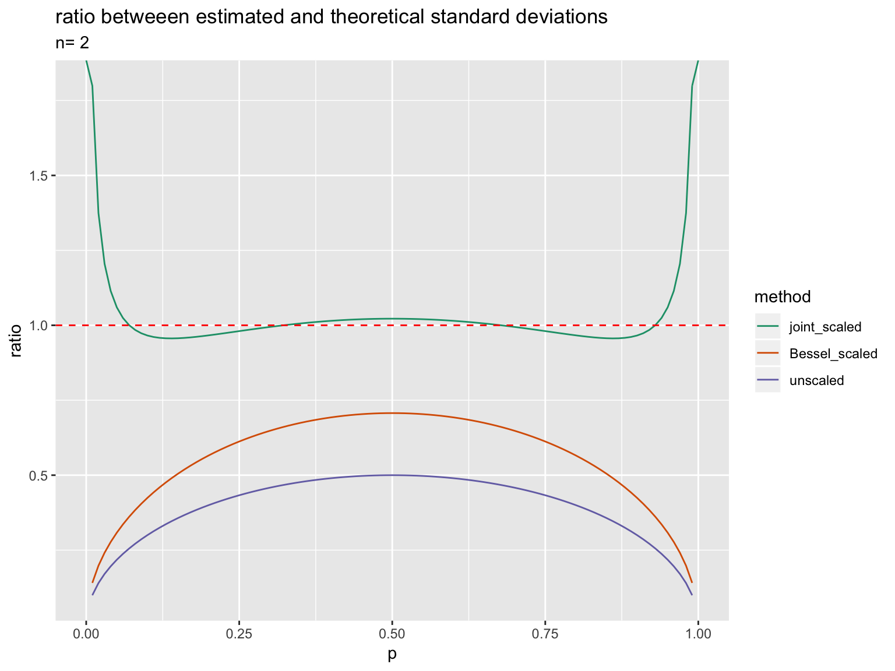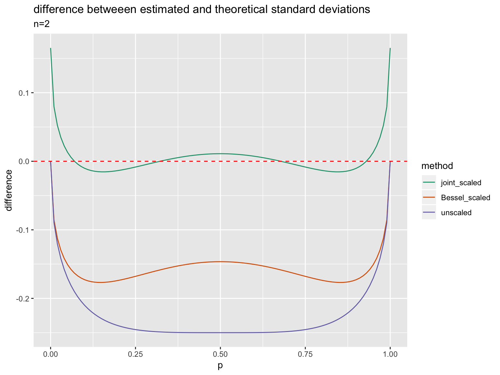

    ## [1] "******"
    ## [1] 3
    ## $multipliers
    ## [1] 0.000000 1.049043 1.049043 0.000000
    ## 
    ## $intercept
    ## [1] TRUE
    ## 
    ## $const
    ##        s0 
    ## 0.1465111


    ## [1] "******"
    ## [1] 4
    ## $multipliers
    ## [1] 0.0000000 1.3858312 0.5018465 1.3858676 0.0000000
    ## 
    ## $intercept
    ## [1] TRUE
    ## 
    ## $const
    ##        s0 
    ## 0.1031395

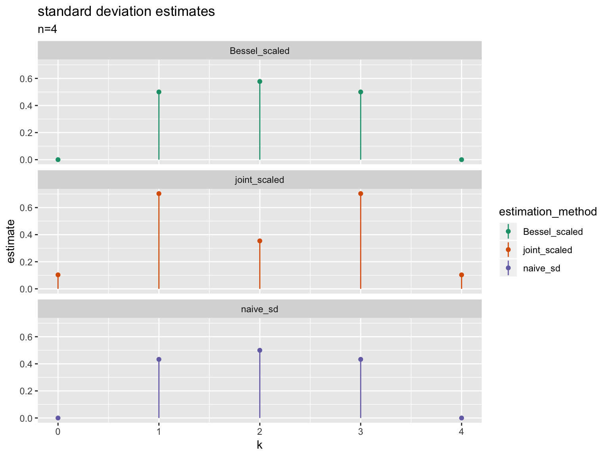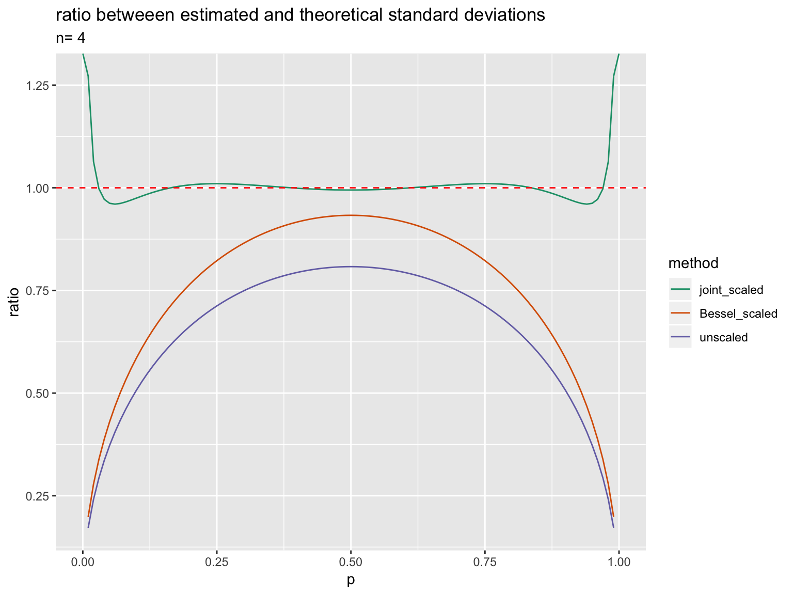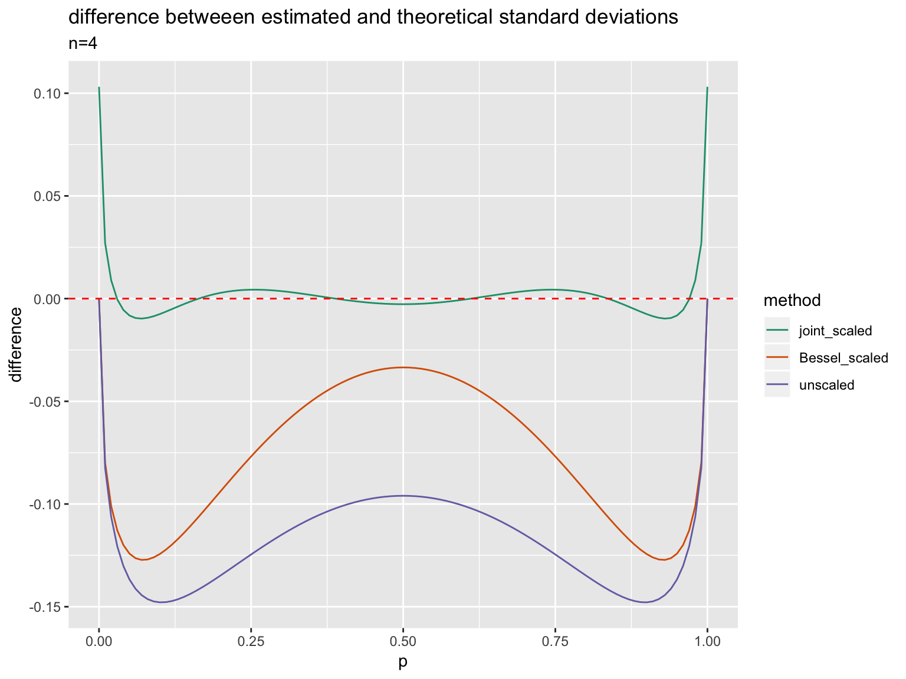

    ## [1] "******"
    ## [1] 5
    ## $multipliers
    ## [1] 0.0000000 1.2637473 0.7857704 0.7868919 1.2632237 0.0000000
    ## 
    ## $intercept
    ## [1] TRUE
    ## 
    ## $const
    ##         s0 
    ## 0.09633953

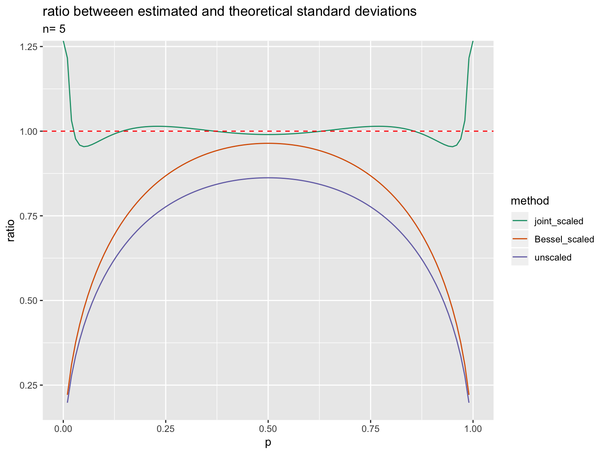

    ## [1] "******"
    ## [1] 10
    ## $multipliers
    ##  [1] 0.0000000 1.2292346 0.7950156 0.8928657 0.9396809 0.9196452 0.9448599
    ##  [8] 0.8874666 0.7975359 1.2287340 0.0000000
    ## 
    ## $intercept
    ## [1] TRUE
    ## 
    ## $const
    ##         s0 
    ## 0.06806992

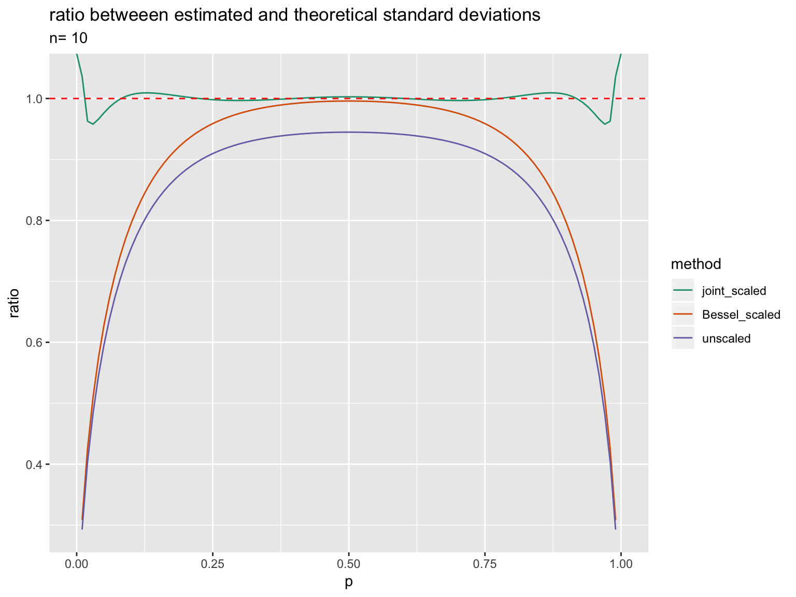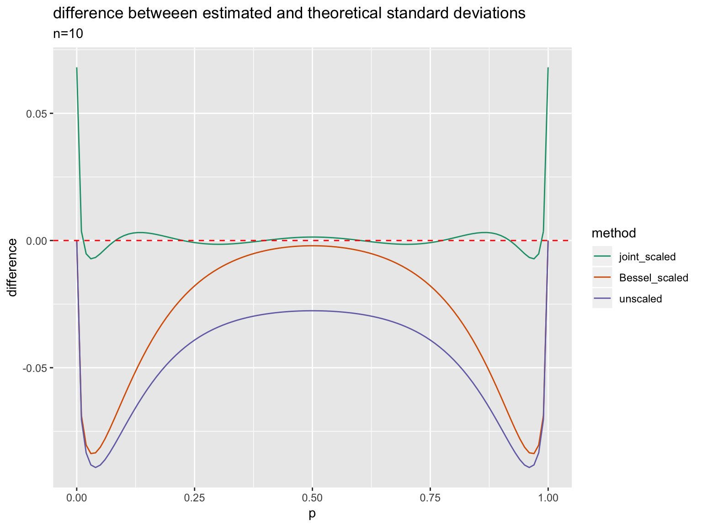

    ## [1] "******"
    ## [1] 20
    ## $multipliers
    ##  [1] 0.0000000 1.1478825 0.8861183 0.8646562 0.9156349 0.9380356 0.9320465
    ##  [8] 0.9215980 0.9200283 0.9257682 0.9302637 0.9279211 0.9216743 0.9206278
    ## [15] 0.9298107 0.9378306 0.9175794 0.8649898 0.8847579 1.1483603 0.0000000
    ## 
    ## $intercept
    ## [1] TRUE
    ## 
    ## $const
    ##         s0 
    ## 0.04929705

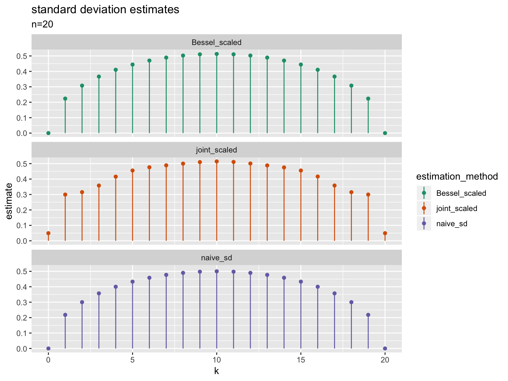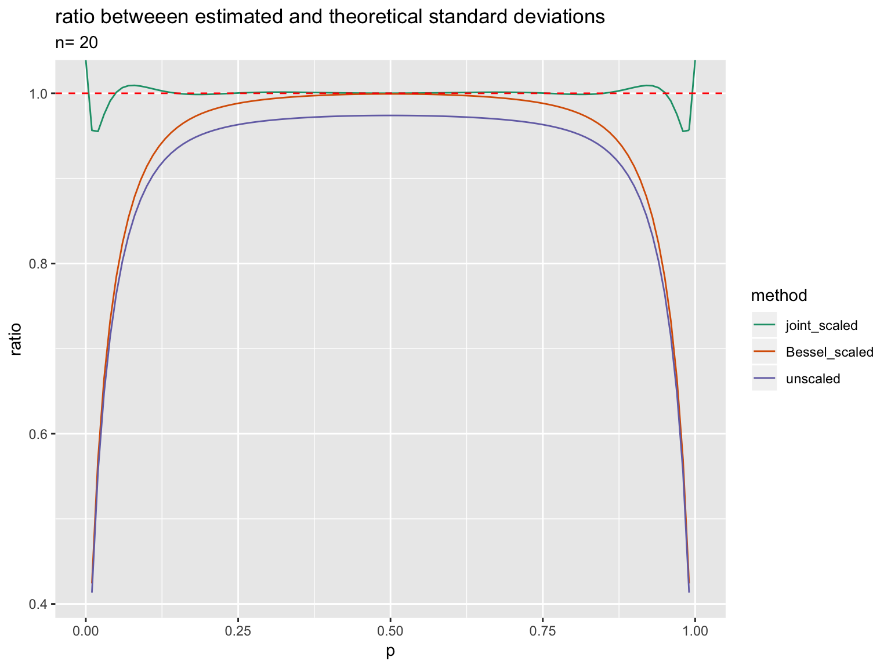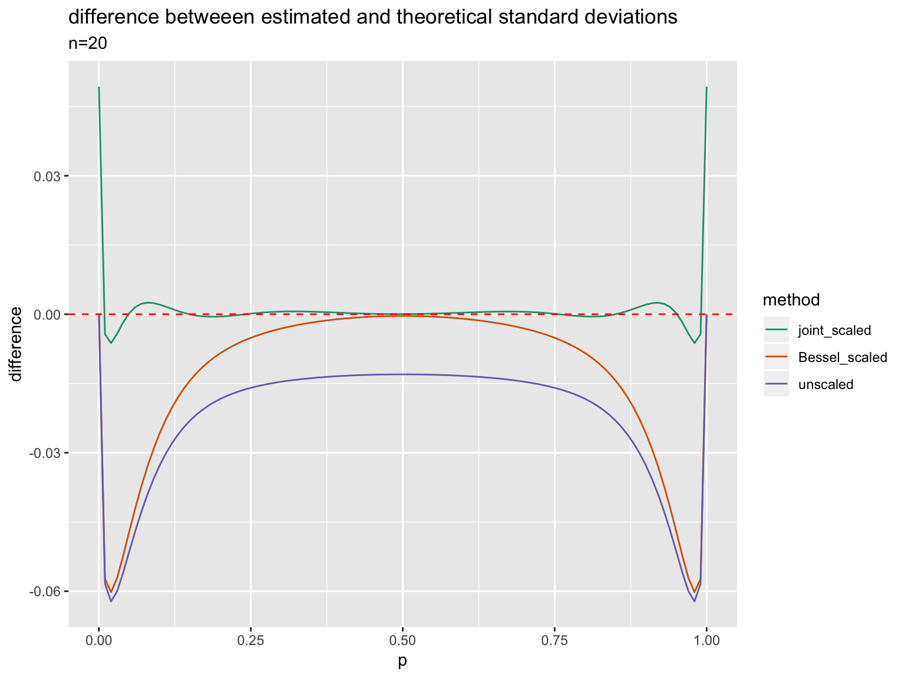

    ## [1] "******"
    ## [1] 100
    ## $multipliers
    ##   [1] 0.0000000 1.0820446 1.0156744 0.9785900 0.9650872 0.9628812 0.9646592
    ##   [8] 0.9671003 0.9690514 0.9703297 0.9710934 0.9715576 0.9718912 0.9721964
    ##  [15] 0.9725205 0.9728751 0.9732528 0.9736392 0.9740198 0.9743836 0.9747233
    ##  [22] 0.9750356 0.9753202 0.9755785 0.9758130 0.9760267 0.9762223 0.9764026
    ##  [29] 0.9765698 0.9767258 0.9768718 0.9770092 0.9771388 0.9772610 0.9773762
    ##  [36] 0.9774848 0.9775866 0.9776816 0.9777697 0.9778506 0.9779242 0.9779902
    ##  [43] 0.9780484 0.9780988 0.9781412 0.9781758 0.9782027 0.9782222 0.9782345
    ##  [50] 0.9782401 0.9782393 0.9782325 0.9782200 0.9782020 0.9781788 0.9781504
    ##  [57] 0.9781166 0.9780773 0.9780321 0.9779807 0.9779225 0.9778570 0.9777838
    ##  [64] 0.9777023 0.9776121 0.9775129 0.9774045 0.9772868 0.9771597 0.9770234
    ##  [71] 0.9768778 0.9767229 0.9765584 0.9763837 0.9761977 0.9759988 0.9757849
    ##  [78] 0.9755532 0.9753007 0.9750244 0.9747222 0.9743934 0.9740402 0.9736685
    ##  [85] 0.9732883 0.9729128 0.9725555 0.9722233 0.9719048 0.9715536 0.9710692
    ##  [92] 0.9702857 0.9689916 0.9670333 0.9645976 0.9628402 0.9650801 0.9786211
    ##  [99] 1.0157288 1.0820817 0.0000000
    ## 
    ## $intercept
    ## [1] TRUE
    ## 
    ## $const
    ##         s0 
    ## 0.01430012

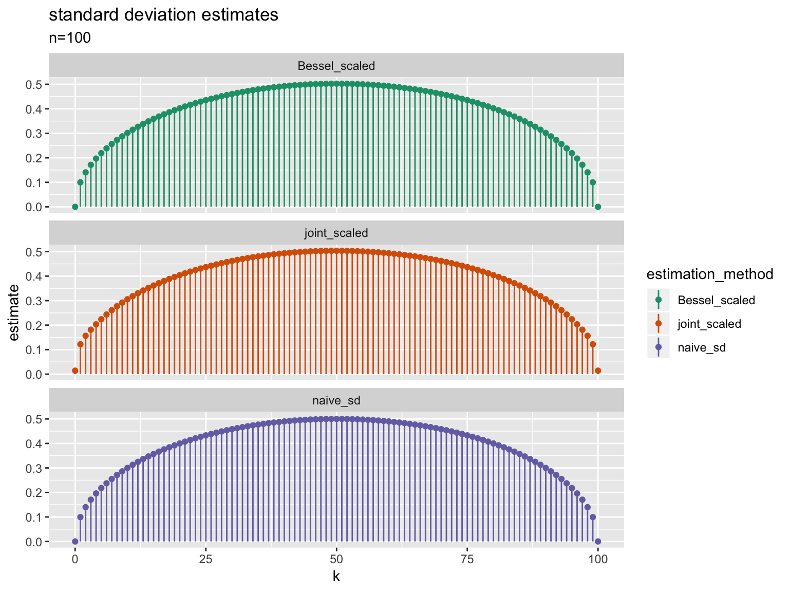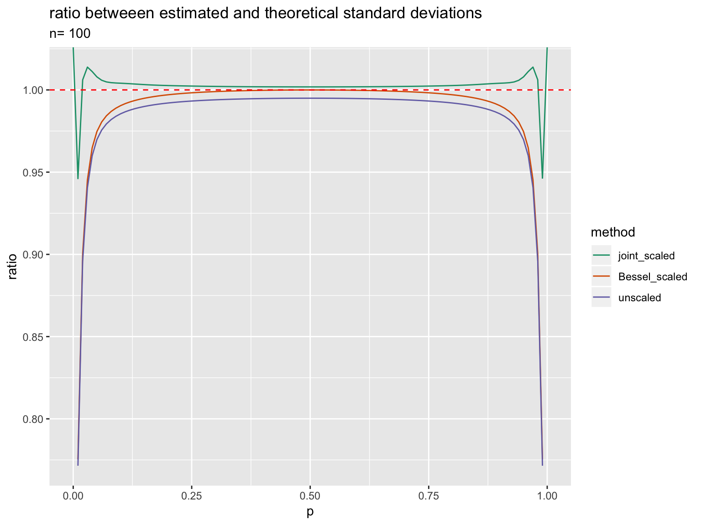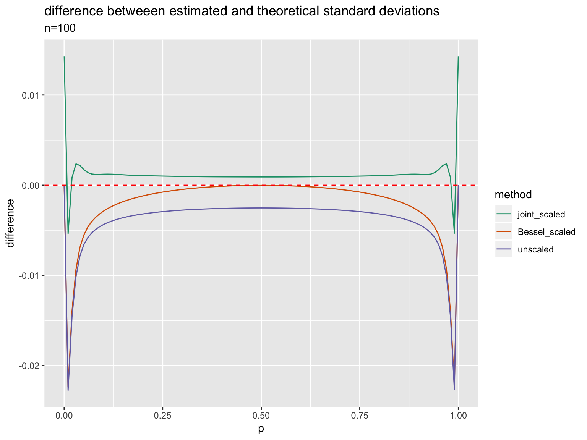

``` r
data <- as.data.frame(Titanic)

data <- data %.>% 
  select_rows_nse(., 
                  (Class == "Crew") & 
                    (Sex == "Female") & 
                    (Age == "Adult")) %.>%
  orderby(., "Survived")

print(data)
```

    ##    Class    Sex   Age Survived Freq
    ## 1:  Crew Female Adult       No    3
    ## 2:  Crew Female Adult      Yes   20

``` r
universe <- c(rep(0, data$Freq[data$Survived=="No"]),
              rep(1, data$Freq[data$Survived=="Yes"]))

print(universe)
```

    ##  [1] 0 0 0 1 1 1 1 1 1 1 1 1 1 1 1 1 1 1 1 1 1 1 1

``` r
summary1 <- function(x, tabu) {
  scale_adjustment_table <- tabu$multipliers
  const <- tabu$const
  naive_var <- mean((mean(x)-x)^2)
  sd_est <- sd(x)
  # https://en.wikipedia.org/wiki/Unbiased_estimation_of_standard_deviation
  # correctly correct for normal, not binomomial as we have here!
  if(length(scale_adjustment_table) != (1+length(x))) {
    stop("wrong sized scale_adjustment table")
  }
  data.frame(mean = mean(x),
             var = var(x),
             sd = sd_est,
             naive_var = naive_var,
             naive_sd = sqrt(naive_var),
             adj_sd = sqrt(naive_var)*scale_adjustment_table[[sum(x)+1]] + const)
}

print("universe")
```

    ## [1] "universe"

``` r
tabu <- solve_for_scaling_table(length(universe), naive_sd_fun, intercept = intercept)
print(tabu)
```

    ## $multipliers
    ##  [1] 0.0000000 1.1353235 0.8985872 0.8699394 0.9114213 0.9341853 0.9341982
    ##  [8] 0.9277480 0.9244943 0.9258603 0.9295613 0.9327943 0.9334894 0.9309085
    ## [15] 0.9263773 0.9235439 0.9264400 0.9342560 0.9355362 0.9118821 0.8688254
    ## [22] 0.8985333 1.1357127 0.0000000
    ## 
    ## $intercept
    ## [1] TRUE
    ## 
    ## $const
    ##         s0 
    ## 0.04589171

``` r
su <- summary1(
  universe, 
  tabu)
print(su)
```

    ##         mean       var        sd naive_var  naive_sd    adj_sd
    ## s0 0.8695652 0.1185771 0.3443502 0.1134216 0.3367812 0.3384957

``` r
n <- length(universe)
Bessel_corrected_var <- (n/(n-1))*su$naive_var
print(Bessel_corrected_var)
```

    ## [1] 0.1185771

``` r
Bessel_corrected_sd <- sqrt(Bessel_corrected_var)
print(Bessel_corrected_sd)
```

    ## [1] 0.3443502

``` r
samp_size <- 5

mk_f <- function(universe, samp_size, summary1, intercept) {
  force(universe)
  force(samp_size)
  force(summary1)
  force(intercept)
  scale_adjustment_table <- 
    solve_for_scaling_table(samp_size, naive_sd_fun, intercept = intercept)
  f <- function(i) {
    sample <- universe[sample.int(length(universe), 
                                  samp_size, 
                                  replace = TRUE)]
    summary1(sample, scale_adjustment_table)
  }
}


f <- mk_f(universe, samp_size, summary1, intercept)


res <- parallel::parLapply(cl, 1:100000, f)
res <- do.call(rbind, res)

print("aggregates")
```

    ## [1] "aggregates"

``` r
sums <- as.data.frame(lapply(res, mean))
print(sums)
```

    ##       mean     var        sd naive_var  naive_sd    adj_sd
    ## 1 0.869408 0.11357 0.2381174  0.090856 0.2129787 0.3353563

``` r
print("sds of aggregates")
```

    ## [1] "sds of aggregates"

``` r
sdss <- as.data.frame(lapply(res, sd))
print(sdss)
```

    ##        mean       var        sd  naive_var  naive_sd   adj_sd
    ## 1 0.1506053 0.1169384 0.2384757 0.09355073 0.2132992 0.240213

``` r
print("stddev est from aggregate mean")
```

    ## [1] "stddev est from aggregate mean"

``` r
print(sqrt(su$mean*(1-su$mean)))
```

    ## [1] 0.3367812

``` r
p1 <- ggplot(data = res, aes(x = naive_sd)) +
  geom_density() + 
  geom_vline(xintercept = sums$naive_sd) +
  geom_vline(xintercept = su$naive_sd, color = "red") + 
  xlim(0, 1) +
  ggtitle(paste0("distribution of naive sd"),
          subtitle = "average shown in black, universe value in red")
print(p1)
```

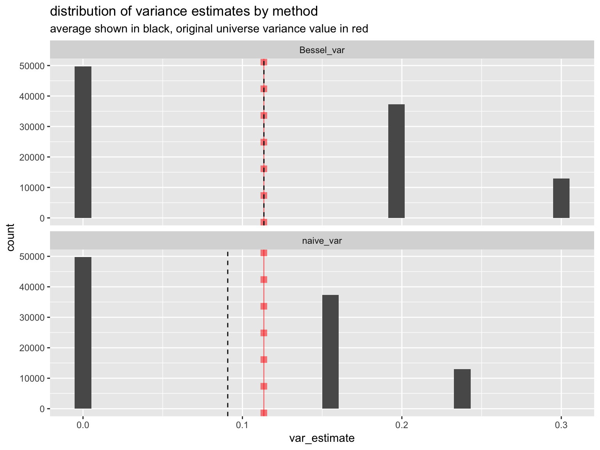

``` r
p2 <- ggplot(data = res, aes(x = adj_sd)) +
  geom_density() + 
  geom_vline(xintercept = sums$adj_sd) +
  geom_vline(xintercept = su$naive_sd, color = "red") + 
  xlim(0, 1) +
  ggtitle(paste0("distribution of ", ifelse(intercept, "affine", "scale")," adjusted sd"),
          subtitle = "average shown in black, universe value in red")
print(p2)
```

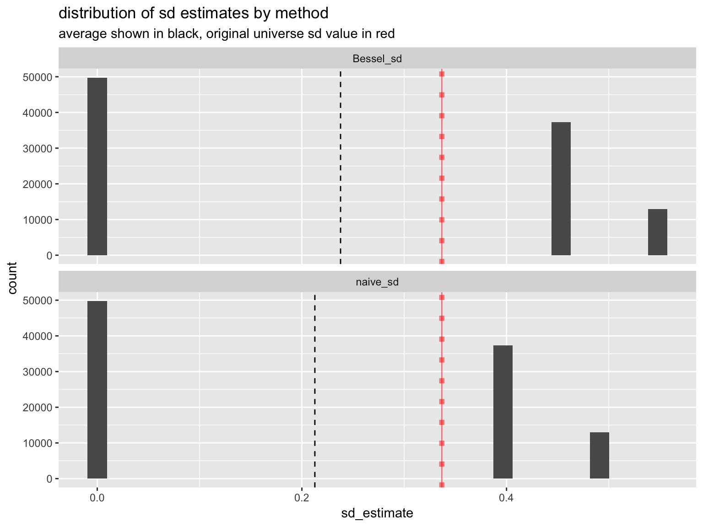

``` r
# cT <- build_unpivot_control(nameForNewKeyColumn = "estimation_method",
#                             nameForNewValueColumn = "sd_estimate",
#                             columnsToTakeFrom = c("adj_sd", "naive_sd"))
# rp <- rowrecs_to_blocks(res,
#                         controlTable = cT)
rp <- unpivot_to_blocks(res,
                        nameForNewKeyColumn = "estimation_method",
                        nameForNewValueColumn = "sd_estimate",
                        columnsToTakeFrom = c("adj_sd", "naive_sd"))

ef <- project_nse(rp, 
                  sd_estimate = mean(sd_estimate), 
                  groupby = "estimation_method")

p3 <- ggplot(data = rp, aes(x = sd_estimate)) +
  geom_density(adjust = 0.5) + 
  geom_vline(xintercept = su$naive_sd, color = "red", alpha = 0.5, size=2) + 
  geom_vline(data = ef, aes(xintercept = sd_estimate)) +
  xlim(0, 1) +  
  facet_wrap(~estimation_method, ncol=1) +
  ggtitle("distribution of sd estimates by method",
          subtitle = "average shown in black, original universe sd value in red")
print(p3)
```

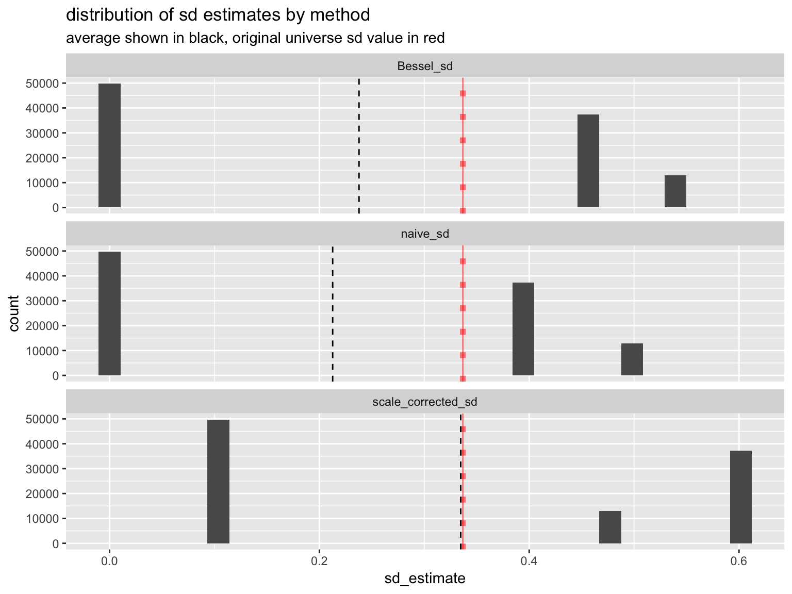

``` r
p4 <- ggplot(data = rp, aes(x = sd_estimate)) +
  geom_histogram(bins = 30) +
  geom_vline(xintercept = su$naive_sd, color = "red", alpha = 0.5, size=2) + 
  geom_vline(data = ef, aes(xintercept = sd_estimate)) +
  xlim(-0.1, 1) +  # work around histogram bug
  facet_wrap(~estimation_method, ncol=1) +
  ggtitle("distribution of sd estimates by method",
          subtitle = "average shown in black, original universe sd value in red")
print(p4)
```

    ## Warning: Removed 2 rows containing missing values (geom_bar).


``` r
parallel::stopCluster(cl)
```
