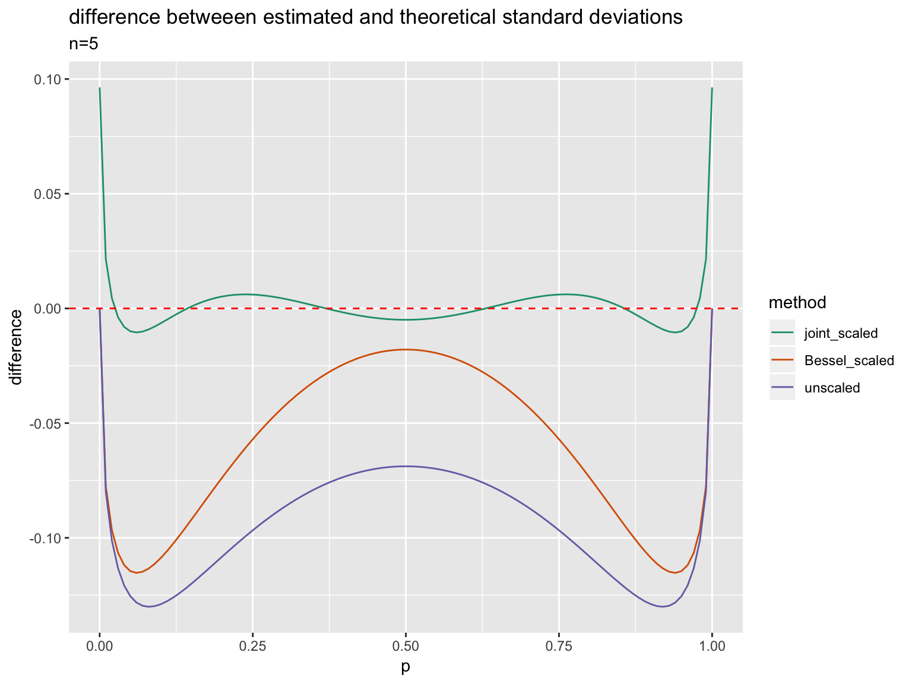

Bias Ests
================

``` r
library("rqdatatable")
```

    ## Loading required package: rquery

``` r
library("wrapr")
library("cdata")
library("ggplot2")
library("glmnet")
```

    ## Loading required package: Matrix

    ## Loading required package: foreach

    ## Loaded glmnet 2.0-16

``` r
set.seed(32535)

naive_sd_fun <- function(x) {
  # also equals (sum(x)/length(x))*(1-sum(x)/length(x))
  sqrt(mean((mean(x)-x)^2))
}

Bessel_sd_fun <- function(x) {
  sd(x)
}

eval_scale_adjustment_table <- function(scale_adjustment_table, p, sd_fun = naive_sd_fun) {
  n <- length(scale_adjustment_table)-1
  obs <- 0:n
  probs <- dbinom(obs, size = n, prob = p)
  evals <- vapply(obs,
                function(ki) {
                  sd_fun(c(rep(1, ki), rep(0, n-ki)))*scale_adjustment_table[[ki+1]]
                }, numeric(1))
  sd_target <- sqrt(p*(1-p))
  sum(probs*evals)/sd_target
}


# related to Wald mini/max type ideas and:
# http://www.win-vector.com/blog/2014/07/frequenstist-inference-only-seems-easy/
# https://mathoverflow.net/questions/177574/existence-of-solutions-of-a-polynomial-system 
# think this is under-determined, so could ask for symmetry or all coefs near 1.
# also a lot like a Chebyshev polynomial (or integral of one), or upside down beta.
# can also try priors like beta(0.5,0.5)
# could also solve for affine version- where we allow addition in addition to scaling.
# must have a really nice form if we integrate the ps-term (likely a calculus of variations solution).
solve_for_scaling_table <- function(n, sd_fun = naive_sd_fun, excess_resolution = 16) {
  if(n<2) {
    return(rep(1, n+1))
  }
  obs <- 1:(n-1)
  vars <- paste0("s_", 1:(n-1))
  ps <- seq(1/(excess_resolution*n), 
            (excess_resolution*n-1)/(excess_resolution*n), 
            by = 1/(excess_resolution*n))
  d <- data.frame(target = sqrt(ps*(1-ps)))
  for(ki in seq_len(length(vars))) {
    k <- obs[[ki]]
    var <- vars[[ki]]
    d[[var]] <- 0
    for(ii in seq_len(length(ps))) {
      pi <- ps[[ii]]
      prob <- dbinom(k, size = n, prob = pi)
      est <- sd_fun(c(rep(1, k), rep(0, n-k)))
      cij <- prob*est
      d[[var]][[ii]] <- cij
      d$target[[ii]] <- d$target[[ii]] - cij # regularize towards zero
    }
  }
  if(length(vars)<=1) {
    m <- lm(mk_formula("target", vars, intercept = FALSE), data= d)
    soln <- as.numeric(m$coefficients) + 1
  } else {
    m <- glmnet(as.matrix(d[, vars, drop = FALSE]), d$target, 
                alpha=0, lambda=1e-6, family = "gaussian", intercept = FALSE,
                weights = dbeta(ps, 0.5, 0.5),
                # lower.limits = -10,
                standardize = FALSE)
    soln <- as.numeric(m$beta) + 1
  }
  c(0, soln, 0)
}

plot_multipliers <- function(tab) {
  n <- length(tab)-1
  dtab <- data.frame(multiplier = tab)
  dtab$observed_count <- 0:(nrow(dtab)-1)
  breaks <- 0:n
  mod <- 10
  while(length(breaks)>20) {
    breaks <- sort(unique(breaks - breaks%%mod))
    mod <- mod*10
  }
  ggplot(data = dtab, 
         mapping = aes(x = observed_count,
                       y = multiplier,
                       ymin = 0,
                       ymax = multiplier)) + 
    geom_point(size=3) +
    geom_linerange() + 
    geom_hline(yintercept = 1, color = "darkgray", linetype=2) + 
    ggtitle(paste0("std-deviation multiplier window, n=", n)) +
    scale_x_continuous(breaks = breaks)
}

plot_estimate_ratios <- function(tab) {
  n <- length(tab)-1
  adjs <- data.frame(p = seq(0, 1, by = 0.01))
  adjs$joint_scaled <- vapply(
    adjs$p,
    function(pi) {
      eval_scale_adjustment_table(tab, pi)
    }, numeric(1))
  adjs$Bessel_scaled <- vapply(
    adjs$p,
    function(pi) {
      eval_scale_adjustment_table(rep(1, length(tab)), pi, sd_fun = Bessel_sd_fun)
    }, numeric(1))
  adjs$unscaled <- vapply(
    adjs$p,
    function(pi) {
      eval_scale_adjustment_table(rep(1, length(tab)), pi)
    }, numeric(1))
  
  
  adjsp <- unpivot_to_blocks(
    adjs, 
    nameForNewKeyColumn = "method", 
    nameForNewValueColumn = "ratio", 
    columnsToTakeFrom = c("joint_scaled", "unscaled", "Bessel_scaled"))
  adjsp <- adjsp[!is.na(adjsp$ratio), , drop = FALSE]
  adjsp$method <- reorder(factor(adjsp$method), -adjsp$ratio)
  
  
  ggplot(data = adjsp, mapping = aes(x = p, y = ratio, color = method)) +
    geom_line() +
    geom_hline(yintercept = 1, color = "red", linetype=2) + 
    scale_color_brewer(palette = "Dark2") + 
    ggtitle(paste0("ratio betweeen estimated and theoretical standard deviations, n=",
                   n))
}

for(n in c(2, 3, 4, 5, 10, 20, 100)) {
  print("******")
  print(n)
  tab <- solve_for_scaling_table(n)
  print(tab)
  plot_multipliers(tab) %.>% print(.)
  plot_estimate_ratios(tab) %.>% print(.)
}
```

    ## [1] "******"
    ## [1] 2
    ## [1] 0.000000 2.208666 0.000000


    ## [1] "******"
    ## [1] 3
    ## [1] 0.000000 1.598742 1.598715 0.000000


    ## [1] "******"
    ## [1] 4
    ## [1]  0.00000000  2.28787190 -0.08011322  2.28791183  0.00000000


    ## [1] "******"
    ## [1] 5
    ## [1] 0.0000000 2.0122346 0.7368832 0.7390467 2.0112480 0.0000000


    ## [1] "******"
    ## [1] 10
    ##  [1] 0.0000000 2.0346467 0.4802704 1.2042416 1.1523668 0.9286623 1.1547608
    ##  [8] 1.2009477 0.4825954 2.0338301 0.0000000


    ## [1] "******"
    ## [1] 20
    ##  [1] 0.0000000 1.8036584 0.8468381 0.9534401 1.0883555 1.0833304 1.0326424
    ##  [8] 1.0061200 1.0117913 1.0296074 1.0391542 1.0312949 1.0125694 1.0047259
    ## [15] 1.0313315 1.0843746 1.0897463 0.9523454 0.8464031 1.8041832 0.0000000



    ## [1] "******"
    ## [1] 100
    ##   [1] 0.000000 1.211359 1.106920 1.048873 1.024846 1.017004 1.015263
    ##   [8] 1.015079 1.014813 1.014122 1.013120 1.012014 1.010964 1.010056
    ##  [15] 1.009318 1.008737 1.008284 1.007926 1.007632 1.007378 1.007150
    ##  [22] 1.006935 1.006730 1.006534 1.006345 1.006165 1.005995 1.005838
    ##  [29] 1.005693 1.005562 1.005444 1.005340 1.005248 1.005167 1.005098
    ##  [36] 1.005037 1.004985 1.004939 1.004899 1.004864 1.004832 1.004802
    ##  [43] 1.004775 1.004749 1.004724 1.004701 1.004680 1.004661 1.004645
    ##  [50] 1.004632 1.004623 1.004619 1.004620 1.004626 1.004637 1.004654
    ##  [57] 1.004677 1.004705 1.004738 1.004776 1.004818 1.004863 1.004913
    ##  [64] 1.004965 1.005021 1.005082 1.005147 1.005217 1.005294 1.005379
    ##  [71] 1.005473 1.005578 1.005695 1.005824 1.005968 1.006125 1.006295
    ##  [78] 1.006479 1.006675 1.006883 1.007106 1.007348 1.007618 1.007930
    ##  [85] 1.008308 1.008779 1.009375 1.010124 1.011034 1.012078 1.013168
    ##  [92] 1.014144 1.014804 1.015037 1.015194 1.016920 1.024769 1.048830
    ##  [99] 1.106932 1.211422 0.000000


``` r
data <- as.data.frame(Titanic)

data <- data %.>% 
  select_rows_nse(., 
                  (Class == "Crew") & 
                    (Sex == "Female") & 
                    (Age == "Adult")) %.>%
  orderby(., "Survived")

print(data)
```

    ##    Class    Sex   Age Survived Freq
    ## 1:  Crew Female Adult       No    3
    ## 2:  Crew Female Adult      Yes   20

``` r
universe <- c(rep(0, data$Freq[data$Survived=="No"]),
              rep(1, data$Freq[data$Survived=="Yes"]))

print(universe)
```

    ##  [1] 0 0 0 1 1 1 1 1 1 1 1 1 1 1 1 1 1 1 1 1 1 1 1

``` r
summary1 <- function(x, scale_adjustment_table) {
  naive_var <- mean((mean(x)-x)^2)
  sd_est <- sd(x)
  # https://en.wikipedia.org/wiki/Unbiased_estimation_of_standard_deviation
  # correctly correct for normal, not binomomial as we have here!
  if(length(scale_adjustment_table) != (1+length(x))) {
    stop("wrong sized scale_adjustment table")
  }
  data.frame(mean = mean(x),
             var = var(x),
             sd = sd_est,
             naive_var = naive_var,
             naive_sd = sqrt(naive_var),
             adj_sd = sqrt(naive_var)*scale_adjustment_table[[sum(x)+1]])
}

tabu <- solve_for_scaling_table(length(universe), naive_sd_fun)
print(tabu)
```

    ##  [1] 0.0000000 1.7507295 0.9059314 0.9453566 1.0628968 1.0781336 1.0423358
    ##  [8] 1.0139508 1.0086728 1.0166048 1.0253736 1.0295972 1.0290340 1.0241831
    ## [15] 1.0158508 1.0090520 1.0151156 1.0430754 1.0775732 1.0617949 0.9453608
    ## [22] 0.9069580 1.7502615 0.0000000

``` r
su <- summary1(
  universe, 
  tabu)
print(su)
```

    ##        mean       var        sd naive_var  naive_sd    adj_sd
    ## 1 0.8695652 0.1185771 0.3443502 0.1134216 0.3367812 0.3183797

``` r
n <- length(universe)
Bessel_corrected_var <- (n/(n-1))*su$naive_var
print(Bessel_corrected_var)
```

    ## [1] 0.1185771

``` r
Bessel_corrected_sd <- sqrt(Bessel_corrected_var)
print(Bessel_corrected_sd)
```

    ## [1] 0.3443502

``` r
samp_size <- 5

mk_f <- function(universe, samp_size, summary1) {
  force(universe)
  force(samp_size)
  force(summary1)
  scale_adjustment_table <- 
    solve_for_scaling_table(samp_size, naive_sd_fun)
  f <- function(i) {
    sample <- universe[sample.int(length(universe), 
                                  samp_size, 
                                  replace = TRUE)]
    summary1(sample, scale_adjustment_table)
  }
}


f <- mk_f(universe, samp_size, summary1)


cl <- parallel::makeCluster(parallel::detectCores())
res <- parallel::parLapply(cl, 1:100000, f)
parallel::stopCluster(cl)
res <- do.call(rbind, res)

sums <- as.data.frame(lapply(res, mean))
print(sums)
```

    ##    mean      var        sd naive_var  naive_sd    adj_sd
    ## 1 0.869 0.113872 0.2387213 0.0910976 0.2135188 0.3488982

``` r
sqrt(su$mean*(1-su$mean))
```

    ## [1] 0.3367812
