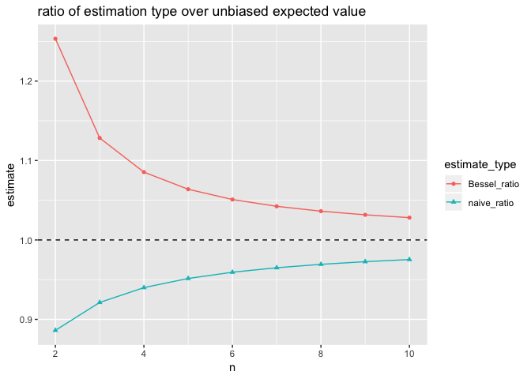
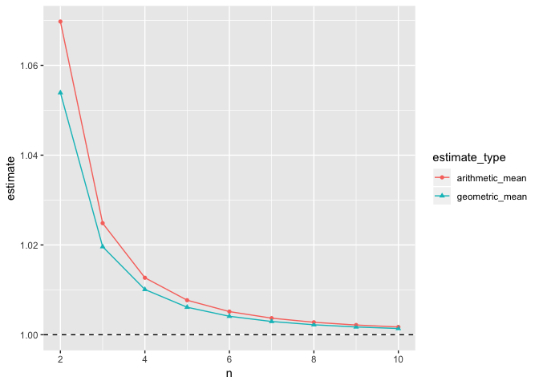

Bias Estimates Normal
================

``` r
library("cdata")
library("ggplot2")

# https://en.wikipedia.org/wiki/Unbiased_estimation_of_standard_deviation
c4 <- function(n) {
  sqrt(2/(n-1))*gamma(n/2)/gamma((n-1)/2)
}

d <- data.frame(n = 2:10)
d$correct <- sqrt(d$n/(d$n-1))*c4(d$n)
d$naive_ratio <- 1/d$correct
d$Bessel_ratio <- sqrt(d$n/(d$n-1))/d$correct
d$arithmetic_mean <- (d$naive_ratio + d$Bessel_ratio)/2
d$geometric_mean <- sqrt(d$naive_ratio * d$Bessel_ratio)


dplot <- unpivot_to_blocks(
  d, 
  nameForNewKeyColumn =  "estimate_type",
  nameForNewValueColumn = "estimate",
  columnsToTakeFrom = qc(naive_ratio, Bessel_ratio,
                         arithmetic_mean, geometric_mean))

ggplot(
  data = dplot[dplot$estimate_type %in% qc(naive_ratio, Bessel_ratio), , drop = FALSE], 
  aes(x = n, y = estimate,
      color = estimate_type, shape = estimate_type)) +
  geom_point() + 
  geom_line() +
  geom_hline(yintercept = 1, linetype = 2) +
  ggtitle("ratio of estimation type over unbiased expected value")
```



``` r
ggplot(
  data = dplot[dplot$estimate_type %in% qc(arithmetic_mean, geometric_mean), , drop = FALSE], 
  aes(x = n, y = estimate,
      color = estimate_type, shape = estimate_type)) +
  geom_point() + 
  geom_line() +
  geom_hline(yintercept = 1, linetype = 2)
```


