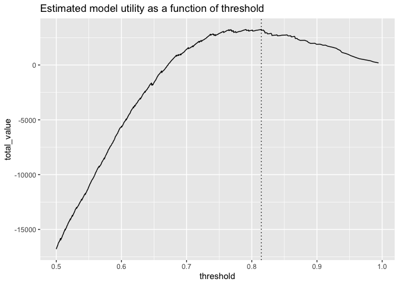
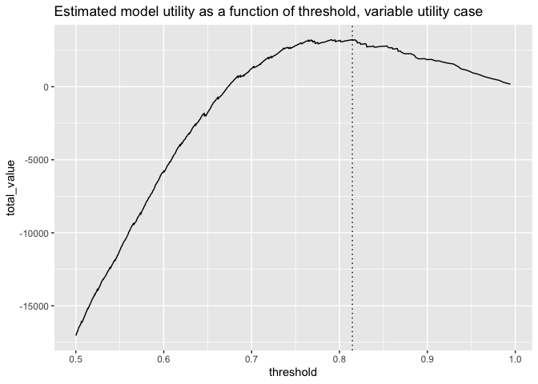

Utility Example
================
Nina Zumel
9/30/2020

Define our data generator function, which we will use to simply
*simulate* the kind of results our data scientist is seeing.

``` r
set.seed(2020)

y_example <- function(n, prevalence = 0.5) {
  data.frame(
    y = sample(
      c(TRUE, FALSE), 
      size = n, 
      replace = TRUE,
      prob = c(prevalence, 1 - prevalence))
  )
}

beta_variable <- function(
  d, 
  shape1_pos, shape2_pos, 
  shape1_neg, shape2_neg) {
  score <- numeric(nrow(d))
  score[d$y] <- rbeta(sum(d$y), shape1 = shape1_pos, shape2 = shape2_pos)
  score[!d$y] <- rbeta(sum(!d$y), shape1 = shape1_neg, shape2 = shape2_neg)
  score
}
```

Then generate some synthetic example data. This is a population where
true positives are relatively rare (1% of the population).

``` r
d <- y_example(10000, prevalence = 0.01)

d$predicted_probability <- beta_variable(
  d,
  shape1_pos = 2, 
  shape2_pos = 1,
  shape1_neg = 6, # 5
  shape2_neg = 6)

library(WVPlots)
```

    ## Loading required package: wrapr

``` r
DoubleDensityPlot(d, "predicted_probability", "y",
                  title = "Model score distribution by true outcome")
```

<!-- -->

## Picking a threshold based on model performance

Let’s look at precision (the probability that a sample scored as “true”
really is true) and recall as a function of threshold.

``` r
ThresholdPlot(d, "predicted_probability", "y",
              title = "Precision and Recall as a function of threshold",
              metrics = c("precision", "recall"))
```

    ## Warning: Removed 1 row(s) containing missing values (geom_path).

<!-- -->

In the abstract, we think we want to use a threshold of at least 0.87 or
so to get decent precision (above 75%). This would only recover us at
most 25% of the actual positives. Is that good enough for our business
needs?

## Picking a threshold based on model *utility*

The way to decide if a possible threshold meets business needs is to
attach utilities to the decisions – right and wrong – that the model
will make. Let’s imagine that this is a sales application, and we are
trying to decide which prospects to target, and our model predicts
probability of conversion.

Every contact we make costs $5, and every successful sale brings in $100
in revenue. We will also add a small penalty for every missed prospect
(one penny), and a small reward for every prospect we correctly ignore
(again, one penny). Let’s add those costs to our score matrix. (You can
leave the last two values at zero, if you prefer).

``` r
d$true_positive_value <- 100 - 5   # revenue - cost
d$false_positive_value <- -5       # the cost of a call
d$true_negative_value <-  0.01      # a small reward for getting them right
d$false_negative_value <- -0.01        # a small penalty for having missed them
```

The `sigr::model_utility()` function then calculates all the costs for
various thresholds.

``` r
library(sigr)
values <- model_utility(d, 
                        model_name = 'predicted_probability', 
                        outcome_name = 'y')
head(values)
```

    ##                   model  threshold count_taken fraction_taken
    ## 1 predicted_probability 0.09404537       10000         1.0000
    ## 2 predicted_probability 0.09544061        9999         0.9999
    ## 3 predicted_probability 0.09729061        9998         0.9998
    ## 4 predicted_probability 0.10019397        9997         0.9997
    ## 5 predicted_probability 0.10642298        9996         0.9996
    ## 6 predicted_probability 0.11079776        9995         0.9995
    ##   true_positive_value false_positive_value true_negative_value
    ## 1               10070               -49470                0.00
    ## 2               10070               -49465                0.01
    ## 3               10070               -49460                0.02
    ## 4               10070               -49455                0.03
    ## 5               10070               -49450                0.04
    ## 6               10070               -49445                0.05
    ##   false_negative_value total_value true_negative_count false_negative_count
    ## 1                    0   -39400.00                   0                    0
    ## 2                    0   -39394.99                   1                    0
    ## 3                    0   -39389.98                   2                    0
    ## 4                    0   -39384.97                   3                    0
    ## 5                    0   -39379.96                   4                    0
    ## 6                    0   -39374.95                   5                    0
    ##   true_positive_count false_positive_count
    ## 1                 106                 9894
    ## 2                 106                 9893
    ## 3                 106                 9892
    ## 4                 106                 9891
    ## 5                 106                 9890
    ## 6                 106                 9889

Each row of `values` returns the appropriate counts and values for a
classifier rule that labels cases as TRUE when `predicted_probability >=
threshold`. Now we can determine the total value returned by the model
on our evaluation set, as a function of threshold.

``` r
library(ggplot2)

vhigh <- subset(values, threshold >= 0.5) # just look at thresholds > 0.5
p <- ggplot(vhigh, aes(x = threshold, y = total_value)) + 
  geom_line() + 
  ggtitle("Estimated model utility as a function of threshold")

# find the maximum utility
max_ix <- which.max(vhigh$total_value)
best_threshold <- vhigh$threshold[max_ix]

p + geom_vline(xintercept = best_threshold, linetype=3)
```

<!-- -->

``` r
# print out some information about the optimum
(best_info <- vhigh[max_ix, c("threshold", "count_taken", "fraction_taken", "total_value")])
```

    ##      threshold count_taken fraction_taken total_value
    ## 9892 0.8146655         109         0.0109     3252.53

This suggests that with this model we should use threshold 0.81, which
translates to calling the top 1.09% of the prospects.

We can compare this to the best possible performance on this data
(calling all of the successful prospects, and only them), simply by
positing a “wizard model” that scores true cases as 1.0 and false cases
as 0.0

``` r
# add a column for the wizard model
d$wizard <- with(d, ifelse(y, 1.0, 0.0))

# calculate the wizard's model utilities
wizard_values <- model_utility(d, 
                               model_name = 'wizard',
                               outcome_name = 'y')
wizard_values[, c("threshold", "count_taken", "fraction_taken", "total_value")]
```

    ##   threshold count_taken fraction_taken total_value
    ## 1       0.0       10000         1.0000   -39400.00
    ## 2       0.5         106         0.0106    10168.94
    ## 3        NA           0         0.0000       97.88

``` r
# amount of potential value in this population
potential = wizard_values$total_value[2]

# what we realized
realized = best_info$total_value

# fraction realized
frac_realized = realized/potential
```

The `threshold = 0.5` row tells us that the potential value of this
population sample is $10168.94, of which our model realized 32%.

### Advanced: Variable Utilities

In the above example, we assigned constant utilities and costs to the
data set. Here, instead of assuming a fixed revenue of $100 dollars on
conversions, we’ll assume that revenue varies by prospect (with an
average of $100).

``` r
# replace the true positive value
d$true_positive_value <- rnorm(nrow(d), mean = 100, sd = 25) - 5   # revenue - cost

# recalculate the values and potential
values <- model_utility(d, 
                        model_name = 'predicted_probability', 
                        outcome_name = 'y')

wizard_values <- model_utility(d, 
                               model_name = 'wizard',
                               outcome_name = 'y')
```

Here we replot the utility curve.

``` r
vhigh <- subset(values, threshold >= 0.5) # just look at thresholds > 0.5
p <- ggplot(vhigh, aes(x = threshold, y = total_value)) + 
  geom_line() + 
  ggtitle("Estimated model utility as a function of threshold, variable utility case")

# find the maximum utility
max_ix <- which.max(vhigh$total_value)
best_threshold <- vhigh$threshold[max_ix]

p + geom_vline(xintercept = best_threshold, linetype=3)
```

<!-- -->

``` r
# print out some information about the optimum
(best_info <- vhigh[max_ix, c("threshold", "count_taken", "fraction_taken", "total_value")])
```

    ##      threshold count_taken fraction_taken total_value
    ## 9892 0.8146655         109         0.0109    3231.148

``` r
# compare to potential
wizard_values[2, c("threshold", "count_taken", "fraction_taken", "total_value")]
```

    ##   threshold count_taken fraction_taken total_value
    ## 2       0.5         106         0.0106    9779.299
