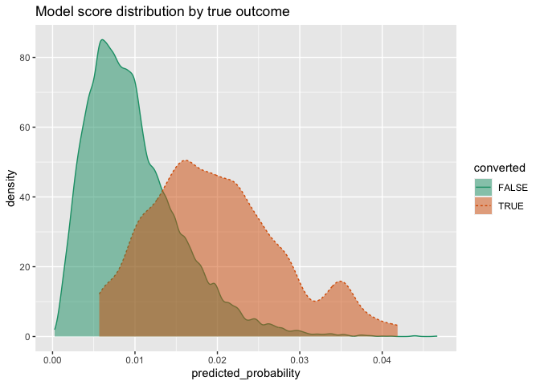

Squeezing the Most Utility from Your Models
================

In a [previous
article](https://win-vector.com/2020/08/07/dont-use-classification-rules-for-classification-problems/)
we discussed why it’s a good idea to prefer probability models to “hard”
classification models, and why you should delay setting “hard”
classification rules as long as possible. But decisions have to be made,
and eventually you will have to set that threshold. How do you do it?

A good threshold balances classifier precision/recall or
sensitivity/specificity in a way that best meets the project or business
needs. One way to quantify and think about this balance is the notion of
*model utility*, which maps the performance of a model to some notion of
the value achieved by that performance. In this article, we demonstrate
the use of
[`sigr::model_utility()`](https://winvector.github.io/sigr/reference/model_utility.html)
to estimate model utility and pick model thresholds for classification
problems.

## The Example Problem

Let’s imagine that we have a sales application, and we are trying to
decide which prospects to target. We want to build a model that predicts
the probability of conversion, based on certain prospect
characteristics.

For our example, suppose we have a population where true positives are
relatively rare (about 1% of the population), and we have trained a
model that returns predictions like this on an evaluation set, `d`:

``` r
library(WVPlots)
DoubleDensityPlot(d, "predicted_probability", "converted",
                  title = "Model score distribution by true outcome")
```

<!-- -->

(For the data generation code, see [the source code for this
article](https://github.com/WinVector/sigr/blob/main/extras/UtilityExample.Rmd)).

We want to contact prospects with a higher probability of converting;
that is, prospects who score above a certain threshold. How how do we
set that threshold? Note that the usual default threshold of 0.5 will
fail spectacularly with this model, since both positive and negative
examples score quite low. This is not uncommon in low positive
prevalence situations.

## Picking a threshold based on model performance

We might try picking the threshold by looking at model performance.
Let’s look at precision (the probability that a sample scored as
“true” really is true) and recall (the fraction of conversions
found) as a function of threshold.

``` r
ThresholdPlot(d, "predicted_probability", "converted",
              title = "Precision and Recall as a function of threshold",
              metrics = c("precision", "recall"))
```

<!-- -->

For the sake of efficiency, we’d like to reduce the number of
unsuccessful calls as much as possible, which implies we’d like a
decision policy with high precision. The best precision we can get with
this model occurs at a threshold of around 0.034 or 0.035 or so, and at
that point the recall is quite low. Is that classifier good enough for
our business needs? This can be hard to tell, as the business needs are
likely in dollars, rather than in false positive/false negatives, and so
on.

## Picking a threshold based on model *utility*

The way to decide if a possible threshold meets business needs is to
attach utilities to the decisions – right and wrong – that the model
will make. To do this, we need to assign costs and rewards to contacting
(or not contacting) a prospect.

Suppose every contact we make costs $5, and every successful conversion
brings in $100 in net revenue. For demonstration purposes, we will also
add a small penalty for every missed prospect (one penny), and a small
reward for every prospect we correctly ignore (again, one penny). Let’s
add those costs to our model frame. (You can leave the last two values
at zero, if you prefer).

``` r
d$true_positive_value <- 100 - 5   # net revenue - cost
d$false_positive_value <- -5       # the cost of a call
d$true_negative_value <-  0.01     # a small reward for getting them right
d$false_negative_value <- -0.01    # a small penalty for having missed them
```

As we vary the decision threshold, we vary the number of prospects
contacted, and the number of successful conversions. We can use the
costs and rewards above to calculate the total value (or the *total
utility*) realized by a decision policy over the evaluation set. The
threshold that realizes the highest utility is the best threshold to use
with a given model (for now, we ignore also modeling uncertainty).

The `sigr::model_utility()` function can calculate all the costs for
various thresholds.

``` r
library(sigr)
values <- model_utility(d, 
                        model_name = 'predicted_probability', 
                        outcome_name = 'converted')
```

The `model_utility()` function returns a data frame with the following
columns:

| model                  | threshold | count\_taken | fraction\_taken | true\_positive\_value | false\_positive\_value | true\_negative\_value | false\_negative\_value | total\_value | true\_negative\_count | false\_negative\_count | true\_positive\_count | false\_positive\_count |
| :--------------------- | --------: | -----------: | --------------: | --------------------: | ---------------------: | --------------------: | ---------------------: | -----------: | --------------------: | ---------------------: | --------------------: | ---------------------: |
| predicted\_probability | 0.0002494 |        10000 |          1.0000 |                 10070 |                \-49470 |                  0.00 |                      0 |   \-39400.00 |                     0 |                      0 |                   106 |                   9894 |
| predicted\_probability | 0.0002564 |         9999 |          0.9999 |                 10070 |                \-49465 |                  0.01 |                      0 |   \-39394.99 |                     1 |                      0 |                   106 |                   9893 |
| predicted\_probability | 0.0002711 |         9998 |          0.9998 |                 10070 |                \-49460 |                  0.02 |                      0 |   \-39389.98 |                     2 |                      0 |                   106 |                   9892 |
| predicted\_probability | 0.0003787 |         9997 |          0.9997 |                 10070 |                \-49455 |                  0.03 |                      0 |   \-39384.97 |                     3 |                      0 |                   106 |                   9891 |
| predicted\_probability | 0.0004992 |         9996 |          0.9996 |                 10070 |                \-49450 |                  0.04 |                      0 |   \-39379.96 |                     4 |                      0 |                   106 |                   9890 |
| predicted\_probability | 0.0005422 |         9995 |          0.9995 |                 10070 |                \-49445 |                  0.05 |                      0 |   \-39374.95 |                     5 |                      0 |                   106 |                   9889 |

Each row of `values` returns the appropriate counts and values for a
classifier rule that labels cases as TRUE when `predicted_probability >=
threshold`. Now we can determine the total value returned by the model
on our evaluation set, as a function of threshold.

``` r
library(ggplot2)

t_bound <- 0.015
vhigh <- subset(values, threshold >= t_bound) # just look at thresholds >= t_bound
p <- ggplot(vhigh, aes(x = threshold, y = total_value)) + 
  geom_line() + 
  ggtitle("Estimated model utility as a function of threshold")

# find the maximum utility
max_ix <- which.max(vhigh$total_value)
best_threshold <- vhigh$threshold[max_ix]

p + geom_vline(xintercept = best_threshold, linetype=3)
```

<!-- -->

``` r
# print out some information about the optimum
(best_info <- vhigh[max_ix, c("threshold", "count_taken", 
                             "fraction_taken", "total_value")]) %.>%
  knitr::kable(.)
```

|      | threshold | count\_taken | fraction\_taken | total\_value |
| :--- | --------: | -----------: | --------------: | -----------: |
| 9574 |  0.021672 |          427 |          0.0427 |      2159.45 |

The graph shows that a policy that contacts too many prospects (lower
threshold) will *lose* money (negative utility), while contacting too
few prospects (higher threshold) goes to zero utility. The best tradeoff
with this model is a threshold of 0.022, which translates to contacting
the top 4.27% of the prospects.

If we go back to the precision/recall graph, we see that this optimal
threshold actually doesn’t give us the policy with the highest
precision, but it makes up for that by making more successful contacts.
Picking the threshold from the utility calculation is easier and more
reliable than just eyeballing a threshold from the abstract
recall/precision graph.

### Comparing to best possible performance

We can compare this model’s optimal policy to the best possible
performance on this data (contacting all of the successful prospects,
and only them), simply by positing a “wizard model” that scores true
cases as 1.0 and false cases as 0.0. In this case any threshold between
zero and one (say, 0.5) will perform the same. IFor this situation, the
`model_utility` function will return three rows: one for the policy of
contacting everyone (threshold = 0), one for threshold = 0.5, and one
for the policy of contacting no one (marked as threshold = NA).

``` r
# add a column for the wizard model
d$wizard <- with(d, ifelse(converted, 1.0, 0.0))

# calculate the wizard's model utilities
wizard_values <- model_utility(d, 
                               model_name = 'wizard',
                               outcome_name = 'converted')
wizard_values[, c("threshold", "count_taken", 
                  "fraction_taken", "total_value")] %.>%
  knitr::kable(.)
```

| threshold | count\_taken | fraction\_taken | total\_value |
| --------: | -----------: | --------------: | -----------: |
|       0.0 |        10000 |          1.0000 |   \-39400.00 |
|       0.5 |          106 |          0.0106 |     10168.94 |
|        NA |            0 |          0.0000 |        97.88 |

``` r
# amount of potential value in this population
potential = wizard_values$total_value[2]

# what we realized
realized = best_info$total_value

# fraction realized
frac_realized = realized/potential
```

The `threshold = 0.5` row tells us that the potential value of this
population sample is $10168.94, of which our model realized $2159.45, or
21.2% of the total available value.

### Advanced: Variable Utilities

In the above example, we assigned constant utilities and costs to the
data set. Here, instead of assuming a fixed revenue of $100 dollars on
conversions, we’ll assume that projected potential revenue varies by
prospect (with an average of $100). This potential value could be
contract sizes that we are bidding on, which varies from prospect to
prospect.

``` r
# replace the true positive value with a varying value
d$true_positive_value <- rnorm(nrow(d), mean = 100, sd = 25) - 5   # revenue - cost

# recalculate the values and potential
values <- model_utility(d, 
                        model_name = 'predicted_probability', 
                        outcome_name = 'converted')

wizard_values <- model_utility(d, 
                               model_name = 'wizard',
                               outcome_name = 'converted')
```

Here we replot the utility curve.

``` r
vhigh <- subset(values, threshold >= t_bound) # just look at thresholds >= t_bound
p <- ggplot(vhigh, aes(x = threshold, y = total_value)) + 
  geom_line() + 
  ggtitle("Estimated model utility as a function of threshold, variable utility case")

# find the maximum utility
max_ix <- which.max(vhigh$total_value)
best_threshold <- vhigh$threshold[max_ix]

p + geom_vline(xintercept = best_threshold, linetype=3)
```

<!-- -->

``` r
# print out some information about the optimum
vhigh[max_ix, c("threshold", "count_taken", "fraction_taken", "total_value")] %.>%
  knitr::kable(.)
```

|      | threshold | count\_taken | fraction\_taken | total\_value |
| :--- | --------: | -----------: | --------------: | -----------: |
| 9574 |  0.021672 |          427 |          0.0427 |     2041.251 |

``` r
# compare to potential
wizard_values[2, c("threshold", "count_taken", "fraction_taken", "total_value")] %.>%
  knitr::kable(.)
```

|   | threshold | count\_taken | fraction\_taken | total\_value |
| :- | --------: | -----------: | --------------: | -----------: |
| 2 |       0.5 |          106 |          0.0106 |     10136.36 |

### Reporting Uncertainty

Up until now, we have returned a point utility estimate. It’s better to
use a distribution, or at least an estimate of uncertainty. In our next
note, we will deal with estimating and reporting uncertainty.

## Conclusion

We have shown how to select a classifier threshold directly from policy
utility, using `sigr::model_utility()`. Thinking in terms of utility is
simple, because it’s already the language of your business partners.
