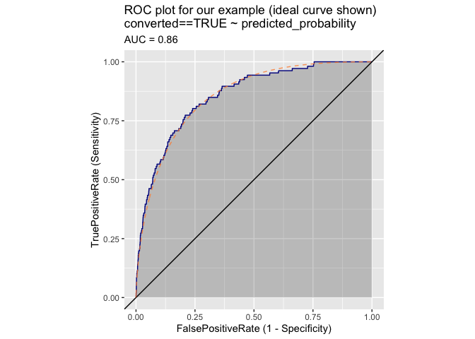
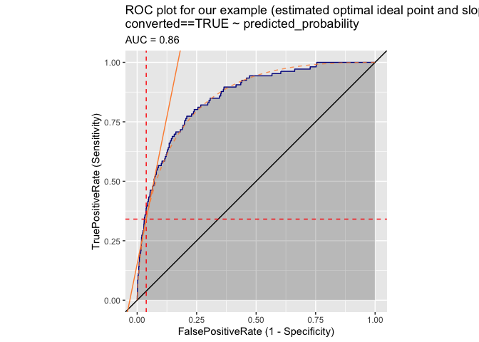

ROC optimization
================

Nina Zumel recently showed how to pick an optimal utility threshold to
convert a model score into a classification rule in [“Squeezing the Most
Utility from Your
Models”](https://win-vector.com/2020/10/05/squeezing-the-most-utility-from-your-models/).

Let’s see how one might implement a similar decision in terms of the
[receiver operating characteristic (ROC)
plot](https://en.wikipedia.org/wiki/Receiver_operating_characteristic).

First let’s attach some packages we are going to use.

``` r
library(ggplot2)
library(sigr)
library(WVPlots)
```

    ## Loading required package: wrapr

Now let’s get the example data `d` and utility specifications from [Nina
Zumel’s “Squeezing the Most Utility from Your
Models”](https://win-vector.com/2020/10/05/squeezing-the-most-utility-from-your-models/).

The complete code for this note (including the example classifier
simulation `d`) can be found
[here](https://github.com/WinVector/sigr/blob/main/extras/utility_modeling/ROC_optimization.Rmd).

``` r
# observed prevalence
observed_prevalence <- mean(d$converted)

#  utilities
true_positive_value <- 100 - 5   # net revenue - cost
false_positive_value <- -5       # the cost of a call
true_negative_value <-  0.01     # a small reward for getting them right
false_negative_value <- -0.01    # a small penalty for having missed them
```

And let’s see this simulated classifier performance in the form of an
ROC plot.

``` r
plt <- ROCPlot(
  d,
  xvar = 'predicted_probability',
  truthVar = 'converted',
  truthTarget = TRUE,
  title = "ROC plot for our example (ideal curve shown)")

ideal_roc <- sigr::sensitivity_and_specificity_s12p12n(
    seq(0, 1, 0.0001),
    shape1_pos = a_pos,
    shape2_pos = b_pos,
    shape1_neg = a_neg,
    shape2_neg = b_neg)

plt + 
  ggplot2::geom_line(
    data = ideal_roc,
    mapping = ggplot2::aes(x = 1 - Specificity, y = Sensitivity),
    color = "#fd8d3c",
    alpha = 0.8,
    linetype = 2)
```

<!-- -->

The standard advice is: given an ROC plot, a population prevalence and
the utilites of true positives, false positives, true negatives, and
false negatives we can determine the optimal classifier threshold by
find a point on the ideal ROC curve that has a given slope.

I say “ideal ROC curve” as we want a curve that is both conves (called
“proper” in [James P. Egan, *Signal Detection Theory and ROC
Analysis*, Academic Press,
1975](https://www.amazon.com/SDT/dp/0122328507)) and continuous. In this
form each slope from vertical to horizontal appears once and only once.
Any empirical graph is going to be stepwise linear, and if there are no
tie-scores literally made up only of vertical and horizontal steps (and
thus not convex, and not continuous\!). So we have the burden of needing
to move to an ideal curve either through parametric means, as we did
here, or through a smoothing filter. In 1975 likely an engineer used a
ruled paper or laid an angle-controlled grid or ruller against the ROC
plot to find the optimal point.

We are also going to have to translate the point on the ROC curve with
the desired slope to a threshold that gives us a classification rule of
the form: all items with a model score at least the threshold are
classified as positive.

Let’s look at a graph relating classifier threshold to slope on the
ideal ROC curve.

``` r
ideal_roc$FalsePositiveRate <- 1 - ideal_roc$Specificity
ideal_roc$slope <- c((ideal_roc$Sensitivity[-nrow(ideal_roc)] - ideal_roc$Sensitivity[-1])/
  (ideal_roc$FalsePositiveRate[-nrow(ideal_roc)] - ideal_roc$FalsePositiveRate[-1]), NA)
ideal_roc <- ideal_roc[complete.cases(ideal_roc), ]

ggplot(
  mapping = aes(x = Score, y = slope),
  data = ideal_roc) + 
  geom_line() + 
  scale_y_log10() + 
  ggtitle("ideal ROC slope as a function of model score threshold")
```

<!-- -->

Finding the optimal threshold for a given combination of ROC plot,
prevalence, and specified utilities is a matter of seeing what desired
slope optimizes utility and then finding the point on the unique point
on ideal ROC plot that has that slope.

This is standard method in ROC optimization and we have a derivation of
the formula for the slope
[here](https://github.com/WinVector/sigr/blob/main/extras/utility_modeling/ROC_utility.ipynb).
For our problem the target slope is given as follows.

``` r
target_slope <- (true_negative_value - false_positive_value) * (1 - observed_prevalence) / 
  (observed_prevalence * (true_positive_value - false_negative_value))
target_slope
```

    ## [1] 4.921919

This is equation 1.18 of Section 1.4.1 “Decision Goal: Maximum Expected
Value” of [James P. Egan, *Signal Detection Theory and ROC Analysis*,
Academic Press, 1975](https://www.amazon.com/SDT/dp/0122328507).

Now we find what model score threshold achieves this slope on the ROC
curve.

``` r
idx <- which.min(abs(ideal_roc$slope - target_slope))
opt <- ideal_roc[idx, ]
t(opt)
```

    ##                          220
    ## Score             0.02190000
    ## Specificity       0.96188007
    ## Sensitivity       0.34090448
    ## FalsePositiveRate 0.03811993
    ## slope             4.94813364

We can add the chosen model score threshold and slope to our slope as a
function of score graph.

``` r
ggplot(
  mapping = aes(x = Score, y = slope),
  data = ideal_roc) + 
  geom_line() + 
  geom_vline(xintercept = opt$Score, color = "red", linetype = 2) + 
  geom_hline(yintercept = opt$slope, color = "red", linetype = 2) + 
  scale_y_log10() + 
  ggtitle("ideal ROC slope as a function of model score threshold",
          subtitle = "optimal pick annotated")
```

<!-- -->

And we can show the selection on the original ROC plot.

``` r
ROCPlot(
  d,
  xvar = 'predicted_probability',
  truthVar = 'converted',
  truthTarget = TRUE,
  title = "ROC plot for our example (estimated optimal ideal point and slope shown)") + 
  ggplot2::geom_line(
    data = ideal_roc,
    mapping = ggplot2::aes(x = 1 - Specificity, y = Sensitivity),
    color = "#fd8d3c",
    alpha = 0.8,
    linetype = 2) + 
  geom_vline(xintercept = opt$FalsePositiveRate, color = "red", linetype = 2) + 
  geom_hline(yintercept = opt$Sensitivity, color = "red", linetype = 2) +
  geom_abline(slope = opt$slope, 
              intercept = opt$Sensitivity - opt$FalsePositiveRate * opt$slope,
              color = "#fd8d3c")
```

<!-- -->

Notice the slope determination for this sort of un-balanced data set is
deep into the left are of the graph where the ROC curve is very
vertical. This greatly hampers the legibility of the graph, and the
reliability of picking off the ideal point graphically. For modern data
science unbalanced problems are very common: advertisement click-through
rates, account cancelation, fraud detection, and many others fall into
this category.

The great advantage of the ROC system was: the ROC plot did not have to
be re-done if prevalence or utility changed. If prevalence or utility
change simple arithmetic yields the new slope, and using a protractor to
orient a ruler finds the point. Or one could rotate the ROC plot so that
the desired slope is mapped to a horizontal line and then look for the
highest point in this orientation.

In 2020 not having to re-graph is not much of an advantage, regenerating
the graph is not hard and can even be part of an interactive tool. A
utility oriented graph (in the style of
[this](https://win-vector.com/2020/10/09/estimating-uncertainty-of-utility-curves/)
or
[this](https://win-vector.com/2020/10/05/squeezing-the-most-utility-from-your-models/))
is more more legible and shows the user more of the operating details
and consequences.
