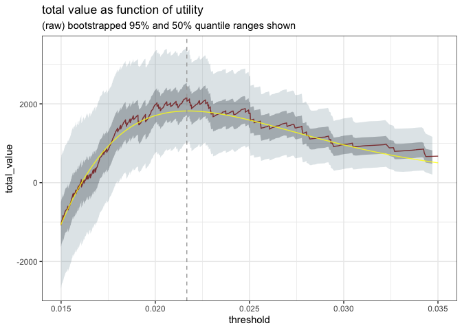

Estimating Uncertainty of Utility Curves
================

Recently, we showed [how to use utility estimates to pick good
classifier
thresholds](https://win-vector.com/2020/10/05/squeezing-the-most-utility-from-your-models/).
In that article, we used model performance on an evaluation set,
combined with estimates of rewards and penalties for correct and
incorrect classifications, to find a threshold that optimized model
utility. This assumes that the evaluation set is similar to the
environment where you plan to apply your model; but of course there will
be some variation. In this article, we will show one way to estimated
the uncertainties of your utility estimates.

## Reviewing the Example

We’ll use the same example as in the previous article: a sales
environment where we want to pick which prospects to target, using a
model that predicts probability of conversion. We start with a data
frame `d` of predicted probabilities and actual outcomes, and then
determine the costs and rewards of different decisions. In our example,
every contact costs $5 and every conversion brings a net revenue of
$100. For demonstration purposes, we also add a small notional reward
for true negatives and a small notional penalty for conversions that we
missed.

``` r
# the data frame of model predictions and true outcome
knitr::kable(head(d, n=3))
```

| converted | predicted\_probability |
| :-------- | ---------------------: |
| FALSE     |              0.0040164 |
| FALSE     |              0.0199652 |
| FALSE     |              0.0132867 |

``` r
#  utilities
true_positive_value <- 100 - 5   # net revenue - cost
false_positive_value <- -5       # the cost of a call
true_negative_value <-  0.01     # a small reward for getting them right
false_negative_value <- -0.01    # a small penalty for having missed them
```

As we saw in the last article, this results in the following utility
curve:

<!-- -->

The best threshold is around 0.022, which brings in an estimated utility
of 2159.45 on the evaluation set. We’ve also plotted a smoothed version
of the utility curve as well. Since utility curves estimated on noisy
data sets can be, well, noisy, it might be more stable to estimate the
optimal threshold on a smoothed curve (we’ll discuss the smoothing
method used here a bit later, below). In this case, we see the optimal
thresholds estimated on the raw data and on the smoothed curve are quite
close (they match to two significant figures), although the total
utility estimate from the smoothed curve at the optimal threshold
appears to be biased down.

## Estimating uncertainty bounds with bootstrapping

Now we have an optimal threshold, which we’ll call `best_threshold`, and
a estimate of the utility of that threshold. You might also want some
uncertainty bars around that estimate. One way to estimate those
uncertainty bars is with [bootstrap
sampling](https://en.wikipedia.org/wiki/Bootstrapping_%28statistics%29#Deriving_confidence_intervals_from_the_bootstrap_distribution).
In fact, if we are patient, we can simulate uncertainty bars for
multiple thresholds (or the entire utility curve) simultaneously.

Bootstrap sampling simulates having multiple evaluation sets with
similar characteristics by sampling from the original data set with
replacement. We generate a new data set by resampling, then call
`sigr::model_utility()` on the new data to generate a new utility curve.
Repeating the procedure over and over again produces a large collection
of curves. These curves give us a distribution of plausible utility
values for every threshold that we are interested in – in particular,
`best_threshold`. From this distribution, we can estimate uncertainty
bounds.

We used the `boot()` function from the `boot` library to implement our
bootstrapping, in a function called `estimate_utility_graph()`; the
source for the function is on github,
[here](https://github.com/WinVector/sigr/blob/main/extras/utility_modeling/calculate_utility_graph.R).
This function generates 1000 bootstrap estimates from the original data,
and returns the relevant summary statistics, in two data frames, as we
[`unpack[]`](https://winvector.github.io/wrapr/reference/unpack.html)
below.

An example use is as follows (we’ll restart from the beginning, so the
code is all in one place):

``` r
library(wrapr)  # misc convenience functions
library(sigr)   # for model_utility()
library(rquery) # data manipulation
library(cdata)  # data manipulation
library(boot)   # bootstrap sampling library
source("calculate_utility_graph.R")

# d is the data frame of model predictions and outcomes

#  utilities
true_positive_value <- 100 - 5   # net revenue - cost
false_positive_value <- -5       # the cost of a call
true_negative_value <-  0.01     # a small reward for getting them right
false_negative_value <- -0.01    # a small penalty for having missed them

# estimate_utility_graph defined in 
# https://github.com/WinVector/sigr/blob/main/extras/utility_modeling/calculate_utility_graph.R

unpack[plot_thin, boot_summary] <- estimate_utility_graph(
  d,
  prediction_column_name = "predicted_probability",
  outcome_column_name = "converted",
  true_positive_value = true_positive_value,
  false_positive_value = false_positive_value,
  true_negative_value = true_negative_value,
  false_negative_value = false_negative_value)
```

(You can see the full use example in [the source code for this
article](https://github.com/WinVector/sigr/blob/main/extras/utility_modeling/Utility_Sampling_Distribution.Rmd).)

The data frame `boot_summary` has columns for the mean utility curve
over all the bootstrap samples, as well as curves for several key
quantiles.

``` r
knitr::kable(head(boot_summary, n=3))
```

| threshold | mean\_total\_value |   q\_0.025 |    q\_0.25 |    q\_0.50 |    q\_0.75 |   q\_0.975 |
| --------: | -----------------: | ---------: | ---------: | ---------: | ---------: | ---------: |
| 0.0002494 |         \-39415.70 | \-41500.00 | \-40100.00 | \-39500.00 | \-38700.00 | \-37400.00 |
| 0.0002564 |         \-39411.70 | \-41494.99 | \-40099.69 | \-39487.47 | \-38694.99 | \-37399.99 |
| 0.0002711 |         \-39407.39 | \-41489.98 | \-40093.71 | \-39479.96 | \-38689.98 | \-37394.86 |

One interesting uncertainty bound is the range between the 2.5th
percentile (`q_.0.025`) and the 97.5th percentile (`q_0.975`), which
holds 95% of the observations around the median. With some abuse of
terminology, you can consider this analogous to a “95% confidence
interval” around your estimated utility.

Right now, the function is hard coded to return estimates at all the
same thresholds used in the original utility curve. You can use this
data to get utility estimates at key threshold values, like
`best_threshold`.

``` r
# find the statistics corresponding to best_threshold
ix = which(abs(boot_summary$threshold - best_threshold) < 1e-5)[1]
best_stats = boot_summary[ix, ] 
knitr::kable(best_stats)
```

|      | threshold | mean\_total\_value | q\_0.025 |  q\_0.25 |  q\_0.50 |  q\_0.75 | q\_0.975 |
| :--- | --------: | -----------------: | -------: | -------: | -------: | -------: | -------: |
| 9574 |  0.021672 |           2114.719 | 1020.626 | 1705.634 | 2083.686 | 2520.049 | 3379.423 |

At `best_threshold`, we estimate that the total value realized will be
in the interval (1020.63, 3379.42) 95% of the time.

The `plot_thin` data frame (in long form so it’s easy to use with
`ggplot2`) again has the mean utility curve over all the bootstrap
samples, the original utility curve from real data, and the smoothed
curve that we showed at the beginning of the article.

``` r
knitr::kable(head(plot_thin, n=3))
```

| threshold | total\_value | estimate           |
| --------: | -----------: | :----------------- |
| 0.0002494 |   \-39415.70 | bootstrapped value |
| 0.0002564 |   \-39411.70 | bootstrapped value |
| 0.0002711 |   \-39407.39 | bootstrapped value |

``` r
unique(plot_thin$estimate)
```

    ## [1] "bootstrapped value" "estimated value"    "parametric fit"

We can use these two data frames to plot the utility curve with
uncertainty. Here we show the original curve, the smoothed curve, and
the 50% and 95% quantile ranges around them.

<!-- -->

## The smoothing curve

Note that our `estimate_utility_graph()` function assumes that all
rewards and costs are constant. This assumption isn’t necessary for the
bootstrapping procedure; it’s only needed for the parametric smoothing
curve that we calculate and add to the `plot_thin` data frame.

For models that return probability scores, we estimate the smoothing
curve by assuming that the conditional distributions of scores for the
positive and negative instances (the distributions shown in the [double
density
plot](https://winvector.github.io/WVPlots/reference/DoubleDensityPlot.html)
of model scores) are both [beta
distributions](https://en.wikipedia.org/wiki/Beta_distribution). We can
find the parameters of the best fit betas with
[sigr::find\_ROC\_matching\_ab()](https://winvector.github.io/sigr/reference/find_ROC_matching_ab.html).
The smoothed utility curve is then the utility curve calculated with the
estimated beta distributions, rather than the raw data.

Why beta distributions? Simply because beta distributions are bound
between 0 and 1 and seem to be a plausible family of shapes for
probability model scores. For logistic regression models, assuming
[logit-normal
distributions](https://en.wikipedia.org/wiki/Logit-normal_distribution)
is also an interesting choice.
