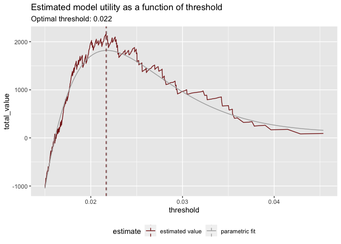
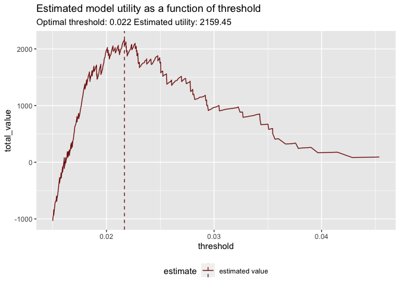

Estimating Uncertainty of Utility Curves
================

``` r
knitr::opts_chunk$set(echo = FALSE)

library(wrapr)
library(sigr)
library(rquery)
library(cdata)
library(ggplot2)
```

    ## 
    ## Attaching package: 'ggplot2'

    ## The following object is masked from 'package:rquery':
    ## 
    ##     arrow

``` r
library(boot)
source("calculate_utility_graph.R")
```

<!-- -->

<!-- -->
