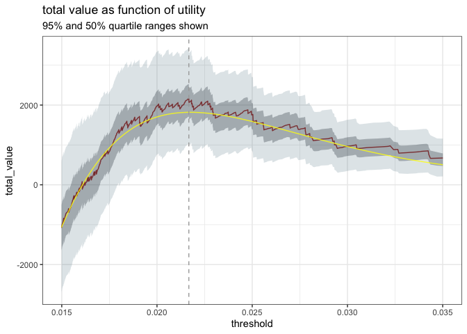

Untitled
================

``` r
library(wrapr)
library(sigr)
library(rquery)
library(cdata)
library(ggplot2)
```

    ## 
    ## Attaching package: 'ggplot2'

    ## The following object is masked from 'package:rquery':
    ## 
    ##     arrow

``` r
library(boot)
       
set.seed(2020)
y_example <- function(n, prevalence = 0.5) {
  data.frame(
    y = sample(
      c(TRUE, FALSE), 
      size = n, 
      replace = TRUE,
      prob = c(prevalence, 1 - prevalence))
  )
}
beta_variable <- function(
  d, 
  shape1_pos, shape2_pos, 
  shape1_neg, shape2_neg) {
  score <- numeric(nrow(d))
  score[d$y] <- rbeta(sum(d$y), shape1 = shape1_pos, shape2 = shape2_pos)
  score[!d$y] <- rbeta(sum(!d$y), shape1 = shape1_neg, shape2 = shape2_neg)
  score
}
#
# generate the example. This looks complicated, but we are trying to generate
# predictions consistent with a calibrated model (like logistic regression)
#
prevalence <- 0.01
a_pos <- 6
b_pos <- 300
a_neg <- 3
p_odds_ratio <- prevalence / (1-prevalence)
pos_mean <- a_pos / (a_pos + b_pos)
b_neg <- a_neg * (  1 / (p_odds_ratio * (1 - pos_mean)) - 1)
stopifnot(b_neg >= 0)
neg_mean <- a_neg / (a_neg + b_neg)
check_p <- prevalence * pos_mean + (1 - prevalence) * neg_mean
stopifnot(abs(prevalence - check_p) < 1e-5)
d <- y_example(10000, prevalence = prevalence)
d$predicted_probability <- beta_variable(
  d,
  shape1_pos = a_pos, 
  shape2_pos = b_pos,
  shape1_neg = a_neg,
  shape2_neg = b_neg)
# change the column name to better match the example
colnames(d) <- c("converted", "predicted_probability")

# utilities
true_positive_value <- 100 - 5   # net revenue - cost
false_positive_value <- -5       # the cost of a call
true_negative_value <-  0.01     # a small reward for getting them right
false_negative_value <- -0.01    # a small penalty for having missed them
d$true_positive_value <- true_positive_value
d$false_positive_value <- false_positive_value
d$true_negative_value <- true_negative_value
d$false_negative_value <- false_negative_value

# actual values
values <- model_utility(d, 'predicted_probability', 'converted')

best_idx <- which.max(values$total_value)
knitr::kable(values[best_idx, ])
```

|      | model                  | threshold | count\_taken | fraction\_taken | true\_positive\_value | false\_positive\_value | true\_negative\_value | false\_negative\_value | total\_value | true\_negative\_count | false\_negative\_count | true\_positive\_count | false\_positive\_count |
| :--- | :--------------------- | --------: | -----------: | --------------: | --------------------: | ---------------------: | --------------------: | ---------------------: | -----------: | --------------------: | ---------------------: | --------------------: | ---------------------: |
| 9574 | predicted\_probability |  0.021672 |          427 |          0.0427 |                  3990 |                 \-1925 |                 95.09 |                 \-0.64 |      2159.45 |                  9509 |                     64 |                    42 |                    385 |

``` r
chosen_threshold <- values$threshold[[best_idx]]
print(chosen_threshold)
```

    ## [1] 0.02167201

``` r
WVPlots::ROCPlot(d, xvar = 'predicted_probability', truthVar = 'converted', truthTarget = TRUE, title = 'ROC')
```

<!-- -->

``` r
# get a plot region
threshold_list <- values$threshold[(!is.na(values$threshold)) & (values$total_value >= -200)]
diff_left <- max(chosen_threshold - threshold_list)
threshold_list <- threshold_list[abs(threshold_list - chosen_threshold) <= 2*diff_left]

f <- function(d, indices, ...) {
  vi <- model_utility(d[indices, ], 'predicted_probability', 'converted')
  fn <- approxfun(vi$threshold, vi$total_value, 
                  yleft = min(vi$total_value),
                  yright = max(vi$total_value))
  fn(threshold_list)
}

boot_stats <- boot(data = d, statistic = f, R = 1000, 
                   parallel = 'multicore', ncpus = parallel::detectCores())
boot_data <- as.data.frame(boot_stats$t)
colnames(boot_data) <- threshold_list
boot_data <- pivot_to_blocks(boot_data, 
                            nameForNewKeyColumn = 'threshold', 
                            nameForNewValueColumn = 'total_value', 
                            columnsToTakeFrom = colnames(boot_data))
boot_data$threshold <- as.numeric(boot_data$threshold)

q_0.025 <- function(x) { quantile(x, probs = 0.025) }
q_0.25 <- function(x) { quantile(x, probs = 0.25) }
q_0.50 <- function(x) { quantile(x, probs = 0.50) }
q_0.75 <- function(x) { quantile(x, probs = 0.75) }
q_0.975 <- function(x) { quantile(x, probs = 0.975) }
boot_summary <- project(boot_data,
                        mean_total_value = mean(total_value),
                        q_0.025 = q_0.025(total_value),
                        q_0.25 = q_0.25(total_value),
                        q_0.50 = q_0.50(total_value),
                        q_0.75 = q_0.75(total_value),
                        q_0.975 = q_0.975(total_value),
                        groupby = 'threshold') %.>%
  orderby(., 'threshold')

value_range <- values[
  (values$threshold >= min(threshold_list)) &
     (values$threshold <= max(threshold_list)), ]

boot_thin <- boot_summary %.>%
  select_columns(., qc(threshold, mean_total_value)) %.>%
  rename_columns(., 'total_value' := 'mean_total_value') %.>%
  extend(., estimate = 'bootstrapped value')

value_thin <- value_range %.>%
  select_columns(., qc(threshold, total_value)) %.>%
  extend(., estimate = 'estimated value')
value_thin <- value_thin[complete.cases(value_thin), , drop = FALSE]


# estimate a parametric value curve
# try to recover per-class beta distribution parameters
unpack[shape1_pos, shape2_pos, shape1_neg, shape2_neg] <-
      sigr::find_ROC_matching_ab(modelPredictions = d$predicted_probability, yValues = d$converted)
total_pos <- sum(d$converted)
total_neg <- sum(!d$converted)
# generate the required tails
theoretical_values <- data.frame(
  estimate = 'parametric fit',
  threshold = values$threshold)
pos_take_count <- pbeta(theoretical_values$threshold, shape1 = shape1_pos, shape2 = shape2_pos, lower.tail = FALSE) * total_pos
pos_take_count[is.na(pos_take_count)] <- 0
neg_take_count <- pbeta(theoretical_values$threshold, shape1 = shape1_neg, shape2 = shape2_neg, lower.tail = FALSE) * total_neg
neg_take_count[is.na(neg_take_count)] <- 0
theoretical_values$true_negative_count <- total_neg - neg_take_count
theoretical_values$false_negative_count <- total_pos - pos_take_count
theoretical_values$true_positive_count <- pos_take_count
theoretical_values$false_positive_count <- neg_take_count
theoretical_values$total_value <- 
  theoretical_values$true_negative_count * true_negative_value +
  theoretical_values$false_negative_count * false_negative_value +
  theoretical_values$true_positive_count * true_positive_value +
  theoretical_values$false_positive_count * false_positive_value


plot_thin <- rbind(boot_thin, value_thin, theoretical_values[, qc(threshold, total_value, estimate)])
plot_thin <- plot_thin[
  (complete.cases(plot_thin)) &
  (plot_thin$threshold >= min(threshold_list)) &
     (plot_thin$threshold <= max(threshold_list)), ]

plot_thin <- plot_thin[plot_thin$estimate != 'bootstrapped value', , drop = FALSE]

ggplot() +
  geom_ribbon(
    data = boot_summary,
    mapping = aes(x = threshold, ymin = q_0.025, ymax = q_0.975),
    alpha = 0.2,
    fill = 'blue') +
  geom_ribbon(
    data = boot_summary,
    mapping = aes(x = threshold, ymin = q_0.25, ymax = q_0.75),
    alpha = 0.3,
    fill = 'green') +
  geom_line(
    data = plot_thin,
    mapping = aes(x = threshold, y = total_value, color = estimate, linetype = estimate)) + 
  geom_vline(xintercept = chosen_threshold) +
  ggtitle("actual versus bootstrap re-sampled utility by threshold")
```

<!-- -->
